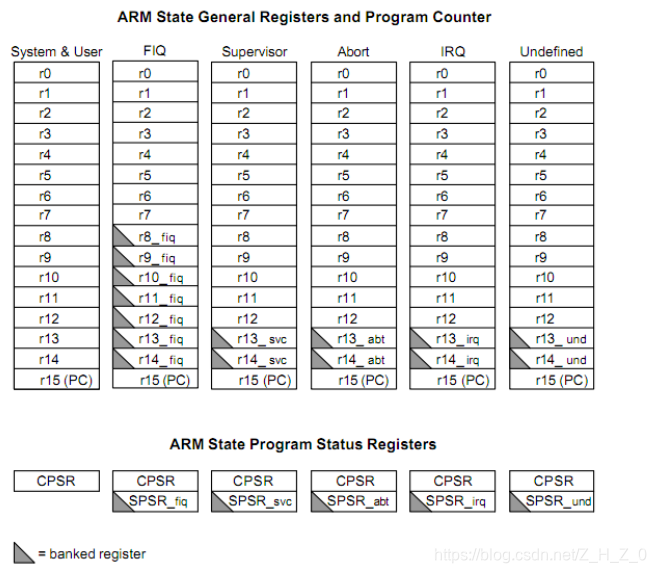

# ARM

## 寄存器

|   寄存器   |                             作用                             | 位数  |
| :--------: | :----------------------------------------------------------: | :---: |
|   R0~R3    |                     通用寄存器，传递参数                     | 32位  |
|   R4~R11   | 通用寄存器，保存局部变量（在 Thumb 程序中通常只能使用 r4~r7 来保存局部变量） | 32位  |
|    R12     |              子程序间scratch寄存器（ip 寄存器）              | 32 位 |
|    R13     |                        通常用做栈指针                        | 32位  |
|    R14     |           连接寄存器，保存子程序以及中断的返回地址           | 32位  |
|    R15     | 程序计数器，由于 ARM 采用了流水线机制，当正确读取了 PC 的值后，该值为当前指令地址加 8 个字节，即 PC 指向当前指令的下两条指令地址 | 32位  |
| CPSR，SPSR | 序状态寄存器其中SPSR是用来保存中断前的CPSR中的值，以便在中断返回之后恢复处理器程序状态 | 32位  |

### CPSR寄存器详解

CPSR有4个8位区域：标志域（F）、状态域（S）、扩展域（X）、控制域（C）

所有处理器模式下都可访问当前程序状态寄存器CPSR。CPSR中包含条件码标志、中断禁止位、当前处理器模式以及其他状态和控制信息。在每种异常模式下都有一个对用的程序状态寄存器SPSR。当异常出现时，SPSR用于保存CPSR的状态，以便异常返回后恢复异常发生时的工作状态。

(1)条件码标志

N、Z、C、V，最高4位称为条件码标志。ARM的大多数指令可以条件执行的，即通过检测这些条件码标志来决定程序指令如何执行。

| 条件码 |                             作用                             |
| :----: | :----------------------------------------------------------: |
|   N    | 在结果是有符号的二进制 补码情况下，如果结果为负数，则N=1；如果结果为非负数，则N=0。 |
|   Z    |          如果结果为0，则Z=1;如果结果为非零，则Z=0。          |
|   C    | 对于加法指令（包含比较指令CMN），如果产生进位，则C=1;否则C=0 ，对于减法指令（包括比较指令CMP），如果产生借位，则C=0;否则C=1，对于有移位操作的非法指令，C为移位操作中最后移出位的值，对于其他指令，C通常不变。 |
|   V    | 对于加减法指令，在操作数和结果是有符号的整数时，如果发生溢出，则V=1;如果无溢出发生，则V=0;对于其他指令，V通常不发生变化。 |

## 指令集

arm指令集占32位，4字节。Thunb指令集一条占用16位，2字节

|  指令  | 用法                  | 作用                                                         |
| :----: | --------------------- | ------------------------------------------------------------ |
|  MOV   | MOV R0, R1            | 将寄存器R1中的数据传给寄存器R0 即R0=R1                       |
|  MOV   | MOV R0, #0X01         | 将立即数0x01传给寄存器R0 即R0=0X01                           |
|  MRS   | MRS R0, CPSR          | 将特殊寄存器(CPSR,SPSR)中的数据传给通用寄存器。              |
|  MSR   | MRS CPSR, R0          | 将通用寄存器中的数据传给特殊寄存器(CPSR,SPSR)。              |
|  LDR   | LDR Rd, [Rn, #offset] | 用于从内存中加载数据到寄存器                                 |
|  STR   | STR Rd, [Rn, #offset] | 用于从内存中加载数据到寄存器。这个指令非常常见，用于访问内存中的变量、数组元素或其他数据 |
|  Push  | PUSH {R0, R1, R2}     | 将寄存器R0、R1、R2中的数据依次压入栈中                       |
|  Pop   | POP {R0, R1, R2}      | 将从栈顶弹出数据，并分别存储到寄存器R2、R1、R0中。           |
| Branch | B target_address      | 将程序无条件地跳转到 target_address 处                       |
|   BL   | BL subroutine_address | 用于调用子程序，并将返回地址保存在链接寄存器中               |
|   BX   | BX LR                 | 从链接寄存器中加载返回地址，实现返回                         |

算数指令

| 指令 | 用法                  | 作用                                                         |
| :--: | --------------------- | ------------------------------------------------------------ |
| ADD  | ADD Rd, Rn, Operand2  | Rd 是目标寄存器，Rn 是源寄存器，Operand2 是另一个操作数。用于将两个操作数相加，并将结果存储在目标寄存器中。 |
| SUB  | SUB Rd, Rn, Operand2  | Rd 是目标寄存器，Rn 是源寄存器，Operand2 是另一个操作数。用于将一个操作数减去另一个操作数，并将结果存储在目标寄存器中。 |
| MUL  | MUL Rd, Rn, Operand2  | Rd 是目标寄存器，Rn 是源寄存器，Operand2 是另一个操作数。用于将两个操作数相乘，并将结果存储在目标寄存器中。 |
| DIV  | SDIV Rd, Rn, Operand2 | Rd 是目标寄存器，Rn 是源寄存器，Operand2 是另一个操作数。用于将一个操作数除以另一个操作数，并将结果存储在目标寄存器中。 |
| AND  | AND Rd, Rn, Operand2  | Rd 是目标寄存器，Rn 是源寄存器，Operand2 是另一个操作数。用于对两个操作数执行按位与操作，并将结果存储在目标寄存器中。 |
| ORR  | ORR Rd, Rn, Operand2  | Rd 是目标寄存器，Rn 是源寄存器，Operand2 是另一个操作数。用于对两个操作数执行按位或操作，并将结果存储在目标寄存器中。 |
| EOR  | EOR Rd, Rn, Operand2  | Rd 是目标寄存器，Rn 是源寄存器，Operand2 是另一个操作数。用于对两个操作数执行按位异或操作，并将结果存储在目标寄存器中。 |
| MVN  | MVN Rd, Rn            | Rd 是目标寄存器，Rn 是源寄存器。用于对一个操作数执行按位取反操作，并将结果存储在目标寄存器中。 |

补充

LDR ：

LDR R0, [R1] ; 将R1寄存器指向的内存地址处的数据加载到R0中
LDR R2, [R3, #8] ; 将R3寄存器指向的内存地址 + 8 处的数据加载到R2中
LDR R4, [R5, R6] ; 将R5寄存器指向的内存地址 + R6 寄存器的值处的数据加载到R4中

条件跳转：

- BEQ（Branch if Equal）：等于零时跳转
- BNE（Branch if Not Equal）：不等于零时跳转
- BLT（Branch if Less Than）：小于时跳转
- BGT（Branch if Greater Than）：大于时跳转
