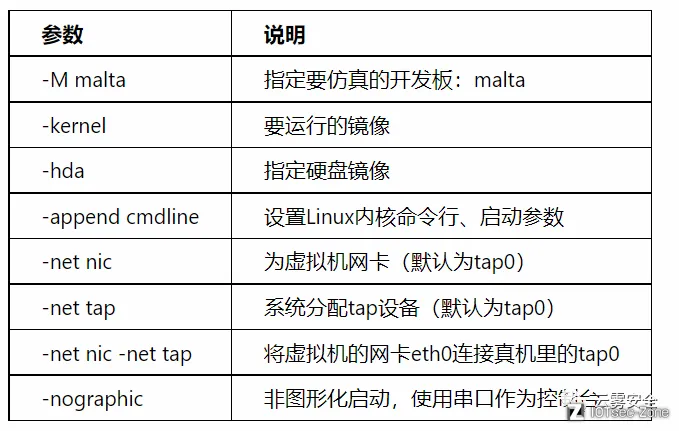

# 一，固件的提取

### binwalk

binwalk是用于搜索给定二进制镜像文件以获取嵌入的文件和代码的工具。具体来说，binwalk是一个固件的分析工具，旨在协助研究人员对固件非分析，提取及逆向工程用处。简单易用，完全自动化脚本，并通过自定义签名，提取规则和插件模块，还重要一点的是可以轻松地扩展。

```
binwalk -Me DIR645A1_FW103RUB08.bin
-M 递归提取固件
-e 自动提取已知文件类型
```

# 二，设置网络环境

```
sudo brctl addbr Virbr0
sudo ifconfig Virbr0 192.168.153.1/24 up
sudo tunctl -t tap0
sudo ifconfig tap0 192.168.153.11/24 up
sudo brctl addif Virbr0 tap0
```

比较老版本的命令。

新版本可以利用ip命令

```
sudo ip link add Virbr0 type bridge
sudo ip addr add 192.168.153.1/24 dev Virbr0
sudo ip link set Virbr0 up

sudo ip tuntap add dev tap0 mode tap
sudo ip link set tap0 up
sudo ip link set tap0 master Virbr0

# 通常不要给 tap0 配 IP
```

清理

```
sudo ip link set tap0 nomaster
sudo ip link del tap0
sudo ip link set Virbr0 down
sudo ip link del Virbr0
```

# 三，模拟路由器环境

使用qemu-system-mips模拟路由器环境，创建启动脚本start.sh并执行命令：

```
sudo qemu-system-mipsel \
  -M malta \
  -kernel vmlinux-2.6.32-5-4kc-malta \
  -hda debian_squeeze_mips_standard.qcow2 \
  -append "root=/dev/sda1 console=tty0" \
  -netdev tap,id=tapnet,ifname=tap0,script=no \
  -device rtl8139,netdev=tapnet \
  -nographic
```

