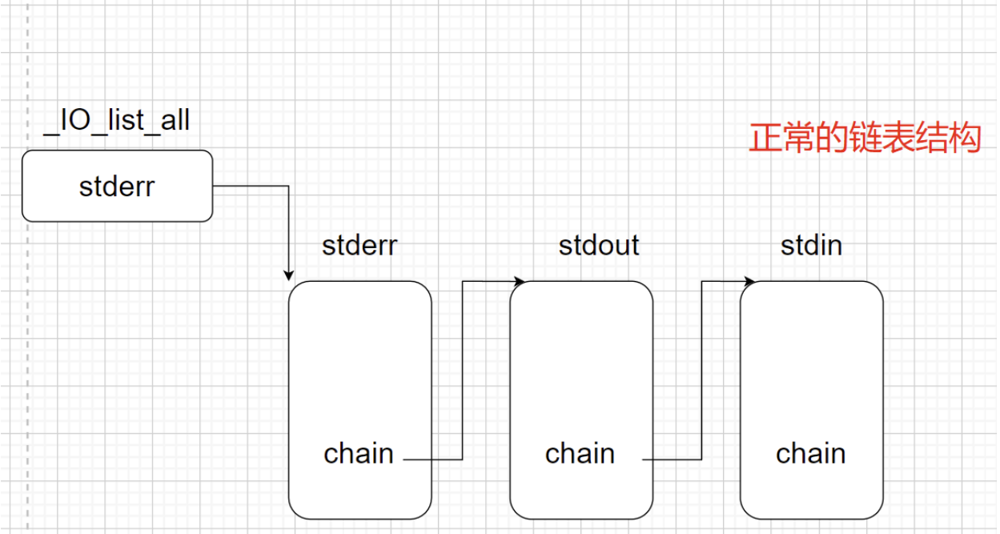

正常链表是否跳转决定于flags位置。如果flags不满足则不会执行而是跳到下一个chain。

IO_FILE结构体：

```c
0x0   _flags
0x8   _IO_read_ptr
0x10  _IO_read_end
0x18  _IO_read_base
0x20  _IO_write_base
0x28  _IO_write_ptr
0x30  _IO_write_end
0x38  _IO_buf_base
0x40  _IO_buf_end
0x48  _IO_save_base
0x50  _IO_backup_base
0x58  _IO_save_end
0x60  _markers
0x68  _chain
0x70  _fileno
0x74  _flags2
0x78  _old_offset
0x80  _cur_column
0x82  _vtable_offset
0x83  _shortbuf
0x88  _lock
0x90  _offset
0x98  _codecvt
0xa0  _wide_data
0xa8  _freeres_list
0xb0  _freeres_buf
0xb8  __pad5
0xc0  _mode
0xc4  _unused2
0xd8  vtable
```

vtable中的函数指针：

```c
const struct _IO_jump_t _IO_wstrn_jumps attribute_hidden =
{
  JUMP_INIT_DUMMY,
  JUMP_INIT(finish, _IO_wstr_finish),
  JUMP_INIT(overflow, (_IO_overflow_t) _IO_wstrn_overflow),
  JUMP_INIT(underflow, (_IO_underflow_t) _IO_wstr_underflow),
  JUMP_INIT(uflow, (_IO_underflow_t) _IO_wdefault_uflow),
  JUMP_INIT(pbackfail, (_IO_pbackfail_t) _IO_wstr_pbackfail),
  JUMP_INIT(xsputn, _IO_wdefault_xsputn),
  JUMP_INIT(xsgetn, _IO_wdefault_xsgetn),
  JUMP_INIT(seekoff, _IO_wstr_seekoff),
  JUMP_INIT(seekpos, _IO_default_seekpos),
  JUMP_INIT(setbuf, _IO_default_setbuf),
  JUMP_INIT(sync, _IO_default_sync),
  JUMP_INIT(doallocate, _IO_wdefault_doallocate),
  JUMP_INIT(read, _IO_default_read),
  JUMP_INIT(write, _IO_default_write),
  JUMP_INIT(seek, _IO_default_seek),
  JUMP_INIT(close, _IO_default_close),
  JUMP_INIT(stat, _IO_default_stat),
  JUMP_INIT(showmanyc, _IO_default_showmanyc),
  JUMP_INIT(imbue, _IO_default_imbue)
};
```

这里对部分字段会有以下检查

```
      if (((fp->_mode <= 0 && fp->_IO_write_ptr > fp->_IO_write_base)
	   || (_IO_vtable_offset (fp) == 0
	       && fp->_mode > 0 && (fp->_wide_data->_IO_write_ptr
				    > fp->_wide_data->_IO_write_base))
	   )
	  && _IO_OVERFLOW (fp, EOF) == EOF)
	result = EOF;
```

如果我们想要执行虚表里面的IO_OVERFLOW需要让mode=0,IO_write_ptr=1,_IO_write_base=0。当然其他的只要满足就行。

任何标准I/O函数（如`printf`、`scanf`、`fread`、`fwrite`、`fclose`等）在执行时，都会**访问和操作对应的`_IO_FILE`结构体**。

当缓冲区满或遇到换行符（对于行缓冲模式），会通过虚表中的`_IO_overflow`函数，最终调用`write`系统调用，将数据真正输出到内核，并将`_IO_write_ptr`复位。