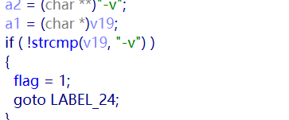
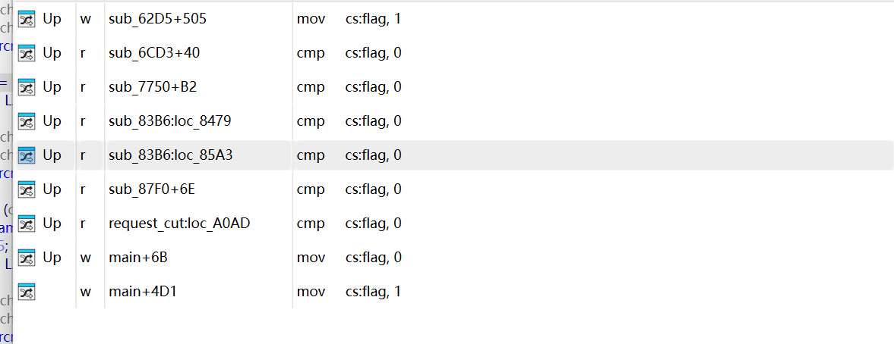
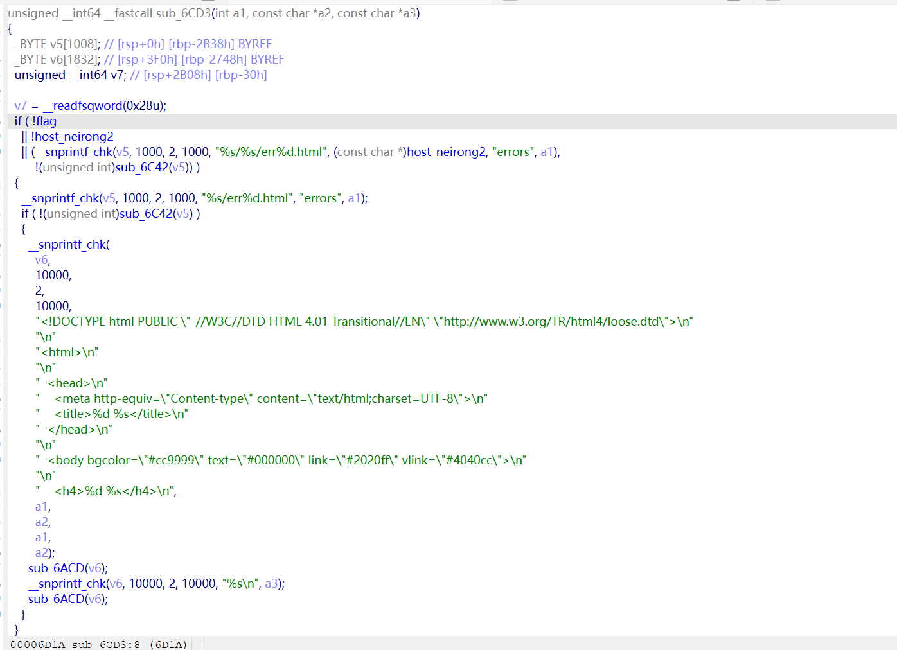
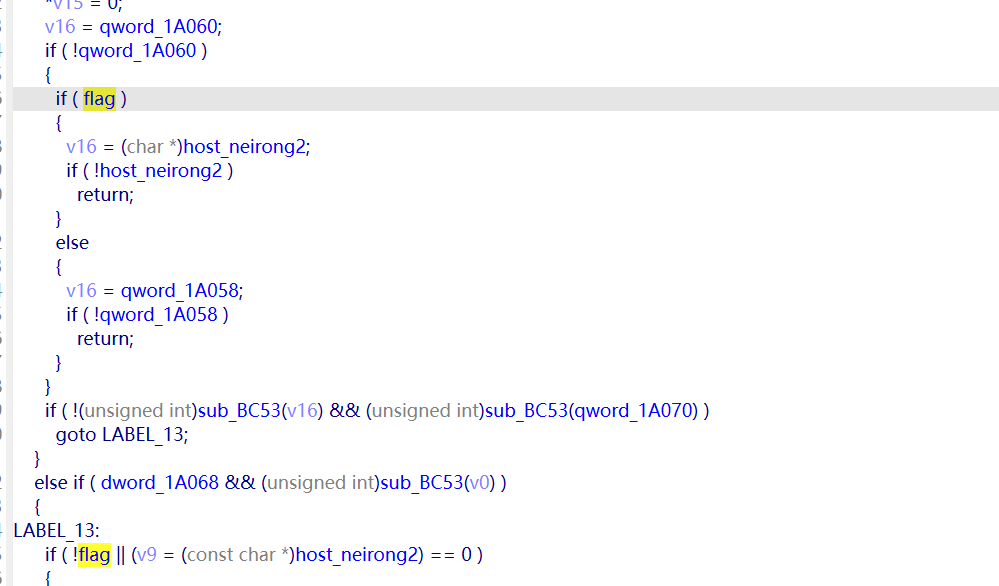

简单了解了一下CVE，选了一个简单的CVE尝试去利用这个CVE的简介分析其漏洞成因。

很水的分析过程。。。。重在学习尝试。

# CVE-2018-18778

根据简要的介绍，大致了解这个漏洞点是出在mini_httped的-v选项。

从任意文件读取结果猜测是过滤出了问题。

从mian函数里面-v选项可以看到只对flag变量进行了赋值。因为上下文有类似的操纵，推测flag函数是某个检查的标志位。



然后通过交叉引用找到flag变量调用的位置



可以看到flag变量共用6处调用是用来进行cmp对比。并且都是跟0进行对比。也更加可以确认这个是某一步的标志位。

然后就是进一步对flag变量进行追踪。

第一处



可以看到出现了大量的errors。很明显这里是一个用来产生错误报文的函数。

```
   if ( flag )
      __snprintf_chk((__int64)v27, 500, 2, 500, "/%s%s");
    else
      snprintf(v27, 0x1F4u, "%s", (const char *)qword_18D20);
```

第二处影响着拼接函数跟复制函数的选择。v27为初始化函数并且分配空间足够没有溢出。之后的qwrd_18D20则是一个全局变量

    if ( !qword_18D20 )
      qword_18D20 = (__int64)"";

交叉引用之后发现这个变量只有这一个输入点。

很明显这里也不是漏洞点。

第三处flag影响的点只有v9，而v9影响的又只是系统日志。

```
  if ( !flag || (v9 = (const char *)host_neirong2) == 0 )
      {
        v9 = qword_1A058;
        if ( !qword_1A058 )
          v9 = "";
      }
      _syslog_chk(6, 2, "%.80s non-local referrer \"%.80s%.80s\" \"%.80s\"", v12, v9, v11, v10);
```

第四处



这里对于flag变量的启用是v16影响赋值，然后v16最终被传入sub_BC53函数。这个函数不多说了核心逻辑很直白按 | 分割字符串。

这里也是没有漏洞点。


第五处，这里flag影响的有点多，感觉上像是漏洞点因为host_beirong1跟2都是host表单里面我们输入的内容。

（但是。。。这里面分析太长了，要追踪的变量太多就不讲了）

最后处，也是真正的漏洞点

```
  if ( flag )
        {
          if ( host_neirong1 )
          {
            host_neirong2 = host_neirong1;
          }
          else
          {
            len[0] = 128;
            v41 = getsockname(fd, &addr, len);
            v42 = "UNKNOWN_HOST";
            if ( v41 >= 0 )
              v42 = (const char *)sub_600F(&addr);
            host_neirong2 = (__int64)v42;
          }
```

这里就很明显了，flag变量跟host_neirong1共同影响着host_neirong2。

```
  else if ( !strncasecmp(v11, "Host:", 5u) )
          {
            host_neirong = &v11[strspn(v11 + 5, " \t") + 5];
            host_neirong1 = (__int64)host_neirong;
            if ( strchr(host_neirong, 47) || *host_neirong == 46 )
              sub_7EE8(0x190u, (__int64)"Bad Request", (int)"", (__int64)"Can't parse request.");
          }
```

host_neirong的值则是从这里被赋值的。

```
          v10 = (const char *)fenli();
          v11 = v10;
          if ( !v10 || !*v10 )
            break;
```

v11来源于此，fenli()函数则是对表单信息进行分离然后通过switch进行选择，最后

```
 if ( flag )
        {
          if ( host_neirong1 )
          {
            host_neirong2 = host_neirong1;
          }
          else
          {
            len[0] = 128;
            v41 = getsockname(fd, &addr, len);
            v42 = "UNKNOWN_HOST";
            if ( v41 >= 0 )
              v42 = (const char *)sub_600F(&addr);
            host_neirong2 = (__int64)v42;
          }
          v39 = (const char *)host_neirong2;
          for ( j = (char *)host_neirong2; ; ++j )
          {
            v43 = *j;
            if ( !*j )
              break;
            if ( ((*__ctype_b_loc())[v43] & 0x100) != 0 )
              *j = (*__ctype_tolower_loc())[v43];
          }
          __snprintf_chk(&unk_164A0, 10000, 2, 10000, "%s/%s", v39, v18);
          ::file = (char *)&unk_164A0;
        }
```

这里直接利用host_neirong2里面的值赋值给了全局变量file

```
         if ( stat(file, &buf) >= 0 )
            {
              ::file = file;
              sub_8CF9();
              goto LABEL_120;
            }
```

这里检查了file函数是否存在然后调用sub_8CF9打开文件。这个函数就不在这分析。之后专门写一下。

第一次尝试去分析CVE分析的很水，之后会慢慢熟练的。

正常去挖CVE应该跟我这个分析过程相反，先确定这里的无过滤拼接函数，然后通过函数调用链去找到这个函数的调取路径，尝试利用函数。我这里主要还是想克服一下对于大文件分析的恐惧，顺道锻炼一下逆向分析能力。

