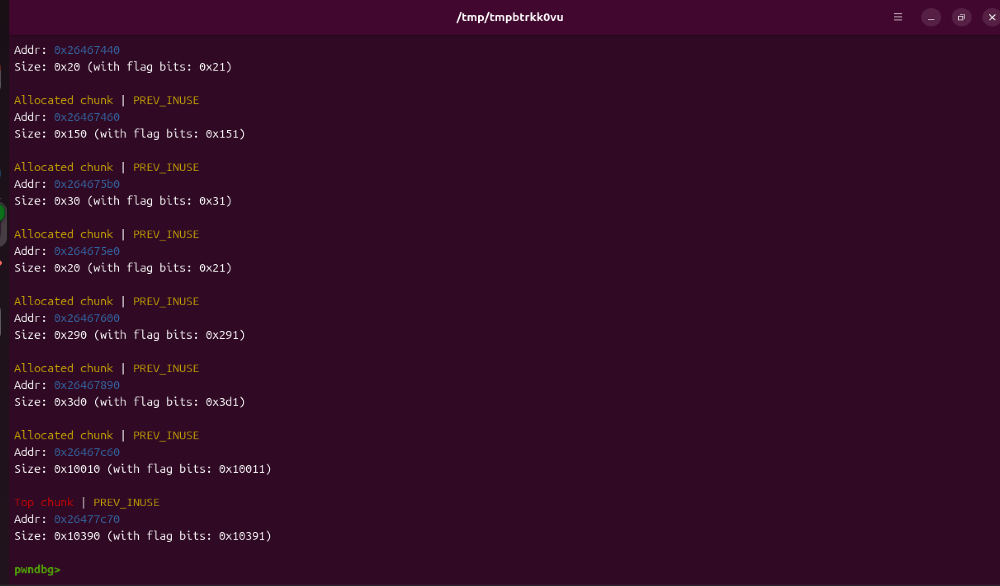
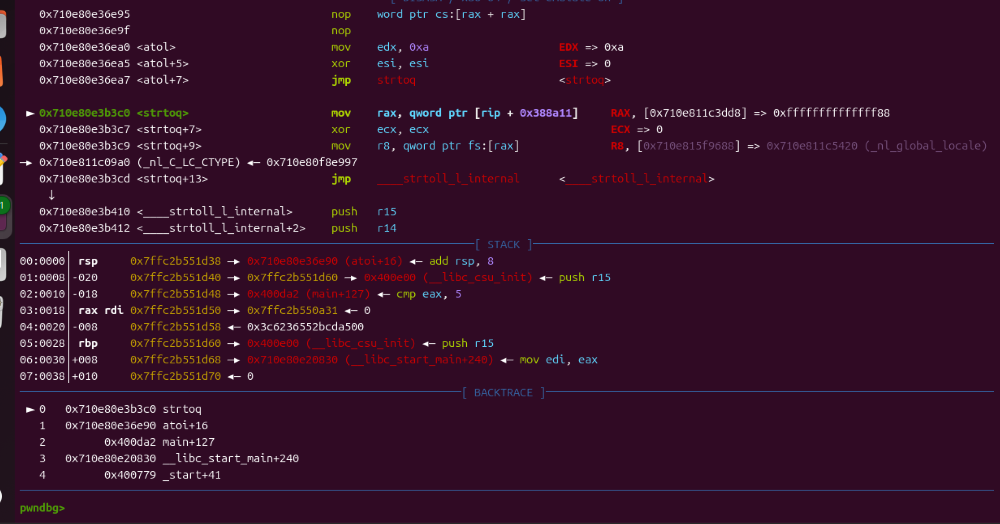
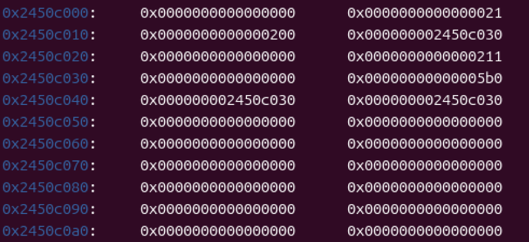
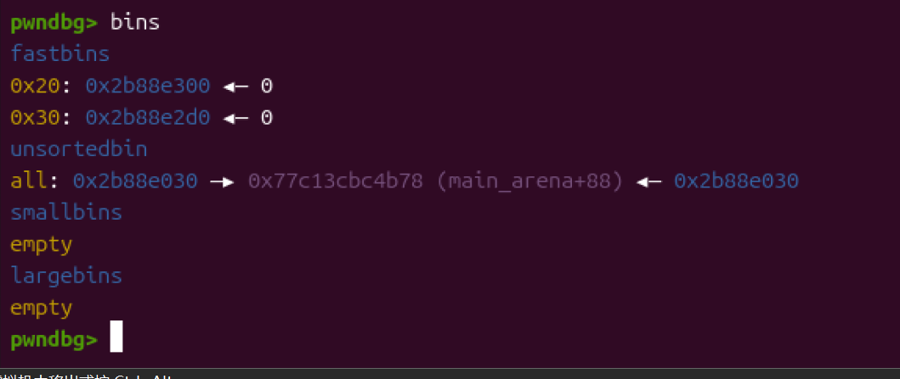
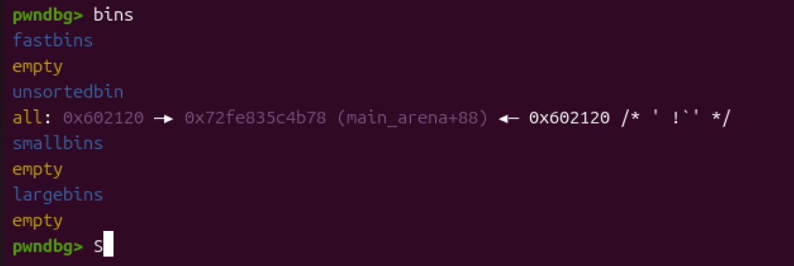
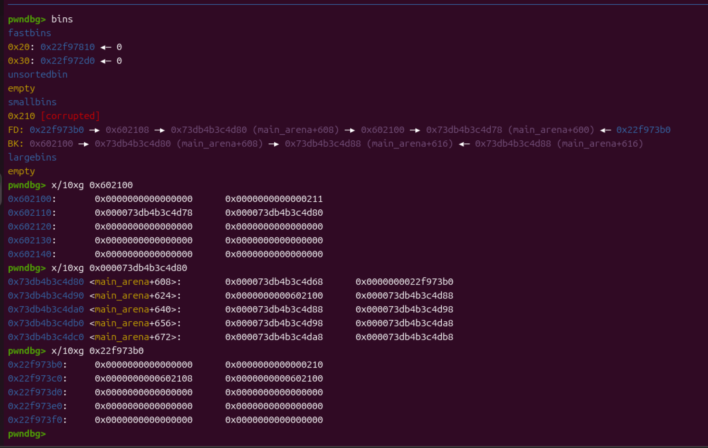

实在找不到太多合适的题目，就拿之前的题目复现house吧

 house of spirit，house of orange 跟house of stom在之前的题目里面有这里就不进行复现了。

先来froce

正常的einherjar应该是利用漏洞去更改top chunk的大小，然后再计算距离申请大堆块到libc的hook地址或者其他地方。但是这个题目因为输入的数字位数只有8位。所以没办法申请出来足够的大堆块。

强行申请就会出现以上崩溃。

然后是einherjar的复现。

同样是这个题

这里在0x2450c030伪造了一个堆块，然后伪造fd/bk指向自己。这样fd->bk就是0x2450c030，同样bk->fd也是自己。从而绕过unlink的检查。

在距离较远的地方进行伪造p头跟size，让系统识别到这个堆块上0x5e0位置有已经释放的堆块。然后释放此堆块触发unlink。

然后unsortedbin里面就出现了堆块。

打程序地址，unlink成功了，但是由于unlink会有一个最终的完整性检查的写入行，对fd赋值为main_arena+88之后会利用fd->bk然后写入bk。导致main_arena地址附近存在程序地址从而使malloc_consolidate崩溃。这样的话其实可以在堆地址写一个程序地址，然后利用修改fd跟bk指向这里绕过unlink的检查。这样被写入的地址就会变成堆块地址就不会崩溃了。

然后是lore

按照文章所说只需要伪造victim的bk跟fake_chunk里面的fd。但是真正尝试下来还需要对fake_chunk的bk进行微调。利用main_arena里面的地址数据进行绕过(victim->bk)->fd == victim检查（可能是我题目的问题，完全打通这个题目可能对堆管理器有损坏。好多文章都没有说这个问题，虽然提到了这个防护但是没有说需要找地方绕过。）

主要的模拟的漏洞是edit after free跟控制地址输入的条件。一遍下来感觉这个house好鸡肋啊，不过对smallbin的理解还是有很大好处的。

首先按照文章所说，在一定地址伪造fake_chunk。

这个里面就是主要的数据了。中间好长时间被ai骗了。ds一直让我把链表终点改为一样的。但是lore要绕过的检查只有(victim->bk)->fd == victim。

很明显在0x602100就是我伪造的fake_chunk。然后在0x22f973b0就是我用来攻击的堆块。最后在0x000073db4b3c4d80处则是用来绕过检查的地方。

先说一下流程。更改了smallbin的bk。这里类似于unsortedbin attack。但是检查更严格，对堆块大小，以及堆块完整性都有检查。

所以这里要伪造的地址要提前设置好两个堆块，一个用来实现控制，另一个用来绕过对于后续堆块的p头检查。

然后就是申请堆块了。这里的bin表是第二次也就是申请0x602100的情况。我们在申请出第一个堆块也就是0x22f973b0后，0x602100的fd会被强行更改为main_arena里面的地址。然后用来储存的smallbin数组的bk也会被存入0x602100。然后堆块申请的时候下一个指向的就是0x602100。到这里fake_chunk就变成了victim。于是我们需要绕过(victim->bk)->fd == victim。可以看到0x22f973b0的bk在第一次申请的时候是不能动的，而0x602100的fd也是。就算动了也没有用后面会覆盖。但是我们可以操纵0x22f973b0的fd跟0x602100的bk，我这里用了0x602108的bk是0x000073db4b3c4d80，然后又利用了0x000073db4b3c4d80的fd是0x602108来绕过检查。

