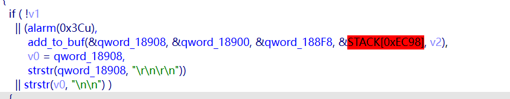

mini_httpd我就不介绍了，一个小型的服务器组件。



问题主要出现在这。中间的条件主要是一下几个方面。

```
// 步骤1: 重置定时器
alarm(0x3Cu);

// 步骤2: 将数据添加到缓冲区
add_to_buf(&qword_18908, &qword_18900, &qword_188F8, &STACK[0xEC98], v2);

// 步骤3: 保存缓冲区指针
v0 = qword_18908;

// 步骤4: 检查缓冲区中是否有 "\r\n\r\n"
// 整个条件的值 = strstr的返回值（非NULL表示找到）
strstr(qword_18908, "\r\n\r\n")
```

这里其实是包含在一个while函数里面，所以这里只要条件不满足就会重新循环，每次的循环都会重置alarm。也就是说只要有数据能发过来就不会被断开。

这是漏洞点一，然后是漏洞点二。

```
void *__fastcall sub_6700(void *a1, size_t a2)
{
  void *result; // rax

  result = realloc(a1, a2);
  if ( !result )
  {
    __syslog_chk(2, 2, "out of memory");
    __fprintf_chk(stderr, 2, "%s: out of memory\n", ident);
    exit(1);
  }
  return result;
}
```

这里的函数在add_to_buf内部，可以看到realloc之前没有任何大小限制的检查，只有一个空字节检查。

而这里是储存我们发送的所有数据的地方。

然后只要我们每隔0x3c秒发送一个字节这个连接就不会断开，所以我们拿到了时间，然后realloc的缺陷又让我们可以随心所欲的发送不同大小的数据包。

然后就衍生出了两种漏洞利用手法，一个是直接在短时间内发送分批次发送大量数据，一个是慢滴式，不断发送很少的数据直到设备内存被完全占据启动oom。